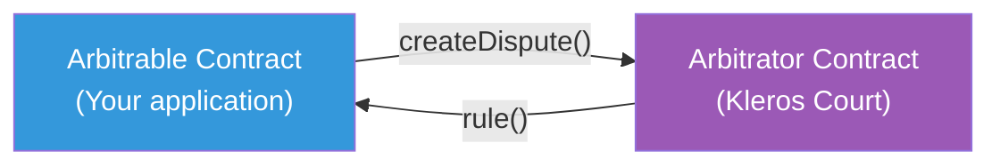
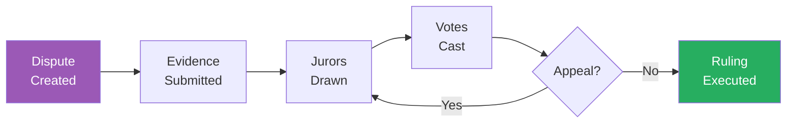

# Dispute Resolution

Kleros provides a general-purpose dispute resolution protocol. Any smart contract can use it as an arbitrator — when a disagreement occurs, the contract sends a dispute to Kleros, jurors vote on the outcome, and the ruling is enforced automatically.

This page explains the core mechanism and why it produces reliable outcomes.

---

## The Core Idea

Kleros is built on a concept from game theory called a **Schelling point** (or focal point). When people are asked to coordinate on an answer without communicating, they tend to converge on the most obvious or "natural" answer. Kleros exploits this by:

1. Drawing a random set of jurors who **cannot communicate** with each other
2. Asking them to independently evaluate evidence and vote on the outcome
3. **Rewarding** jurors who vote with the majority and **penalizing** those who don't

Because each juror knows that other jurors are independently trying to find the "obvious" truthful answer, the rational strategy is to vote honestly. Dishonest jurors risk losing their staked PNK tokens, while honest jurors earn fees and PNK from the dishonest ones.

---

## Arbitrator and Arbitrable

Kleros uses a two-contract architecture:

The **Arbitrable** is any smart contract that might need dispute resolution — an escrow, a marketplace, a registry. It creates disputes and implements a callback function to receive rulings.

The **Arbitrator** is Kleros Court. It handles juror selection, voting, appeals, and ruling delivery. The arbitrable contract never needs to understand the internal mechanics of how jurors are selected or how votes are counted.

This separation means any existing application can plug into Kleros by implementing a simple interface.

---

## Why It Works

Three properties make decentralized dispute resolution viable:

### 1. Economic Alignment

Jurors stake PNK tokens to participate. Incoherent jurors (those who vote against the final majority) lose a portion of their stake, which is redistributed to coherent jurors. This creates a direct financial incentive to seek the truth rather than vote randomly or dishonestly.

### 2. Independent Judgment

Jurors are drawn randomly and vote independently. In V2, hidden votes (commit-reveal) prevent jurors from seeing others' votes before committing their own, eliminating bandwagon effects.

### 3. Escalation Through Appeals

If anyone believes a ruling is wrong, they can fund an appeal. Each appeal round draws more jurors (roughly doubling), making it exponentially more expensive for an attacker to sustain a dishonest majority through repeated rounds. The appeals system is Kleros's ultimate guarantee: as long as honest participants are willing to fund appeals, the system self-corrects.

---

## What Disputes Can Kleros Resolve?

Kleros works best for disputes that are **adjudicable** — meaning a reasonable person, given sufficient evidence, can determine the correct outcome. Examples:

- **"Did the freelancer deliver the work described in the contract?"** — Yes, with evidence
- **"Does this token logo match the submission guidelines?"** — Yes, with policy criteria
- **"Is this address tag accurate?"** — Yes, with on-chain verification

Kleros is not designed for disputes that are purely subjective with no evaluation criteria, or for disputes requiring physical enforcement.

---

## The Dispute Lifecycle

For a detailed walkthrough of every phase, see [How It Works](/court/how-it-works). Here's the high-level flow:

---

## Further Reading

<CardGroup cols={3}>
  <Card title="Game Theory" icon="chess" href="/concepts/game-theory">
    The incentive mechanics behind honest voting
  </Card>
  <Card title="Sortition" icon="dice" href="/concepts/sortition">
    How jurors are randomly selected
  </Card>
  <Card title="Kleros Yellow Paper" icon="file" href="https://kleros.io/yellowpaper.pdf">
    Full formal treatment of the protocol
  </Card>
</CardGroup>