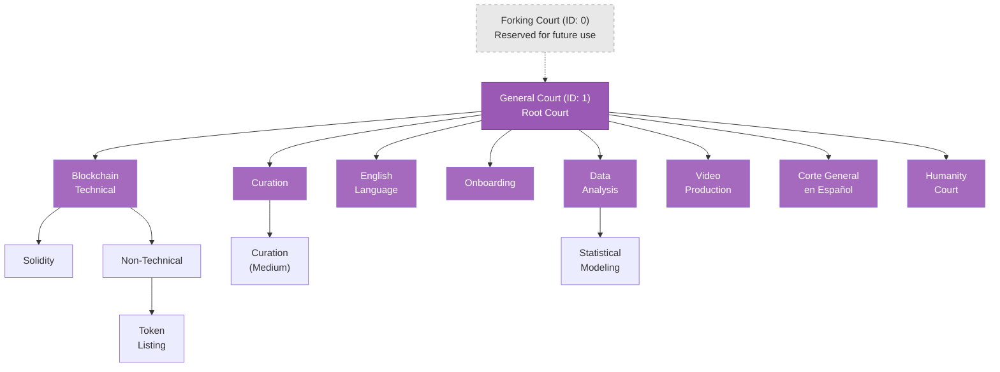

# Court Hierarchy

Kleros courts are organized in a hierarchical tree structure, allowing disputes to be handled by jurors with appropriate expertise while maintaining a clear appeals path.

---

## Court Structure

The court tree forms an arborescence with the General Court as the current root. New courts can be added by governance as Kleros is adopted for additional dispute types.



<Info>This diagram reflects the court tree from the Kleros yellow paper (Figure 5). The live court tree on [court.kleros.io](https://court.kleros.io) may differ as courts are added or modified through governance.</Info>

---

## Court Types

<Tabs>
  <Tab title="General Court">
    **The Root Court (ID: 1)**

    The General Court currently serves as the root of the entire court system. It handles appeals from all specialized courts and has the broadest juror pool — because staking in any specialized court automatically stakes you in all parent courts up to the General Court.

    Every juror in the Kleros system is, by definition, a General Court juror.
  </Tab>
  <Tab title="Specialized Courts">
    **Domain-Specific Expertise**

    Specialized courts focus on specific domains and require relevant expertise from jurors. Each has its own policy document defining rules and requirements.

    Examples from the live court tree:

    - **Blockchain Technical**: Smart contract disputes, protocol-level technical questions
    - **Solidity**: A sub-court of Blockchain Technical for Solidity-specific disputes
    - **Curation**: Token lists, address tags, registry disputes
    - **English Language**: Translation quality, content disputes
    - **Data Analysis / Statistical Modeling**: Data-related disputes
    - **Video Production**: Video content quality disputes
    - **Humanity Court**: Proof of Humanity registration challenges
    - **Corte General en Español**: Spanish-language disputes
  </Tab>
  <Tab title="Forking Court">
    **Reserved for Future Use (ID: 0)**

    Court ID 0 is reserved for the future Forking Court, which will handle protocol-level disputes and serve as the ultimate escalation point. It currently cannot be used for regular disputes.

    <Warning>Court ID 0 is reserved and cannot be used. Attempting to create disputes in the Forking Court will fail.</Warning>
  </Tab>
</Tabs>

---

## Court Parameters

Each court has parameters that define how it operates. These are set during court creation and **can be changed by governance** — so always check [court.kleros.io](https://court.kleros.io) for current live values.

| Parameter | Description | Spec Example |
| --- | --- | --- |
| **Minimum Stake** (`minStake`) | Minimum PNK required to stake in this court | 2,300 PNK |
| **Alpha** (`alpha`) | Basis points controlling how much PNK is locked per vote | 10000 (100%) |
| **Fee For Juror** (`feeForJuror`) | Payment per juror per dispute round | 0.005 ETH |
| **Jurors For Court Jump** (`jurorsForCourtJump`) | Juror threshold that triggers escalation to parent court | 511 |
| **Hidden Votes** (`hiddenVotes`) | Whether commit-reveal voting is used | true / false |
| **Times Per Period** (`timesPerPeriod`) | Duration of each dispute phase in seconds | [280800, 583200, 583200, 388800] |

<Warning>The values above are **specification examples**, not necessarily the current live values. Court parameters are adjusted through governance and may differ on the live protocol. Always verify current values at [court.kleros.io](https://court.kleros.io).</Warning>

### Understanding Alpha

The `alpha` parameter determines how much of your stake is locked when drawn as a juror:

```
pnkAtStakePerJuror = (minStake × alpha) / 10000
```

<Accordion title="Alpha Example">
**With minStake = 2,300 PNK and alpha = 10000 (100%)**

Your locked amount per vote = 2,300 PNK

If alpha were 5000 (50%), your locked amount would be 1,150 PNK per vote. The `alpha` parameter effectively sets the economic risk of participating as a juror — higher alpha means more PNK at stake per vote.
</Accordion>

### Time Periods

Each dispute progresses through four key periods, with durations defined per court:

1. **Evidence Period**: Time for parties to submit evidence
2. **Commit Period**: Time for jurors to commit votes (when `hiddenVotes = true`)
3. **Vote / Reveal Period**: Time for voting or revealing committed votes
4. **Appeal Period**: Time to fund appeals

---

## Automatic Parent Staking

**Critical Concept**: When you stake in a specialized court, you are automatically staked in all parent courts up to the General Court.

What this means in practice:

- Staking in the **Solidity** court = also eligible for **Blockchain Technical** and **General Court** cases
- Staking in **Curation (Medium)** = also eligible for **Curation** and **General Court** cases
- The General Court includes every juror in the entire system

This ensures sufficient juror availability at each level and maintains a proper appeals path where parent courts always have a broader jury pool than their children.

---

## Multi-Court Staking

You can stake in multiple courts, but there are important constraints:

### Court Limit

There is a `MAX_STAKE_PATHS` limit on how many courts a single juror can stake in simultaneously. This exists for gas efficiency — many sortition operations scale linearly with the number of staked courts.

<Note>Verify the current `MAX_STAKE_PATHS` value on-chain or in the [Sortition Module contract](https://github.com/kleros/kleros-v2). If you attempt to stake in more courts than allowed, the transaction will revert with `CannotStakeInMoreCourts`.</Note>

### Choosing Courts

Consider these factors when selecting courts:

1. **Your Expertise**: Match courts to your knowledge areas — read each court's policy before staking
2. **Minimum Stake**: Ensure you meet the court's `minStake` requirement (check live values)
3. **Activity Level**: More active courts = more earning opportunities
4. **Policy Alignment**: Understand and agree with court rules before committing PNK

---

## Court Policies

Each court has a policy document stored on IPFS that defines:

| Section | Description |
| --- | --- |
| **Purpose** | What types of disputes the court handles |
| **Rules** | Guidelines jurors must follow when evaluating evidence |
| **Required Skills** | Knowledge or expertise jurors should possess |
| **Special Procedures** | Any court-specific requirements |

Policies are managed through the `PolicyRegistry` contract and can be updated by governance. Child courts inherit policies from their parent courts — so General Court policies apply everywhere.

<Warning>**Critical for Jurors**: Always read the court policy before staking or voting. Failing to follow court policies may result in incoherent votes and lost PNK.</Warning>

<Card title="Explore Court Policies" icon="building-columns" href="https://court.kleros.io">
  Visit Kleros Court, click on "Courts" and review the policy for any court that interests you.
</Card>

---

## Court Transparency Features

The V2 interface provides enhanced transparency for each court:

- **Top Jurors Staked**: See who has the largest stakes in each court
- **Latest Stakes**: Monitor real-time staking activity
- **Court Statistics**: View dispute history and resolution rates
- **Court Parameters**: All parameters are viewable on-chain and in the Court UI

---

## What's Next?

<CardGroup cols={3}>
  <Card title="Appeals" icon="arrow-up-right-from-square" href="/court/appeals">
    Learn how cases escalate through the hierarchy
  </Card>
  <Card title="How It Works" icon="gears" href="/court/how-it-works">
    Understand the full dispute resolution process
  </Card>
  <Card title="Staking Guide" icon="coins" href="https://kleros.notion.site/Complete-Beginner-s-Guide-to-Kleros-Court-V2-20e9a9db4f08803da1b2c372ed2f2c6e?pvs=74">
    Step-by-step guide to staking in courts
  </Card>
</CardGroup>