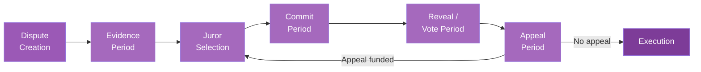
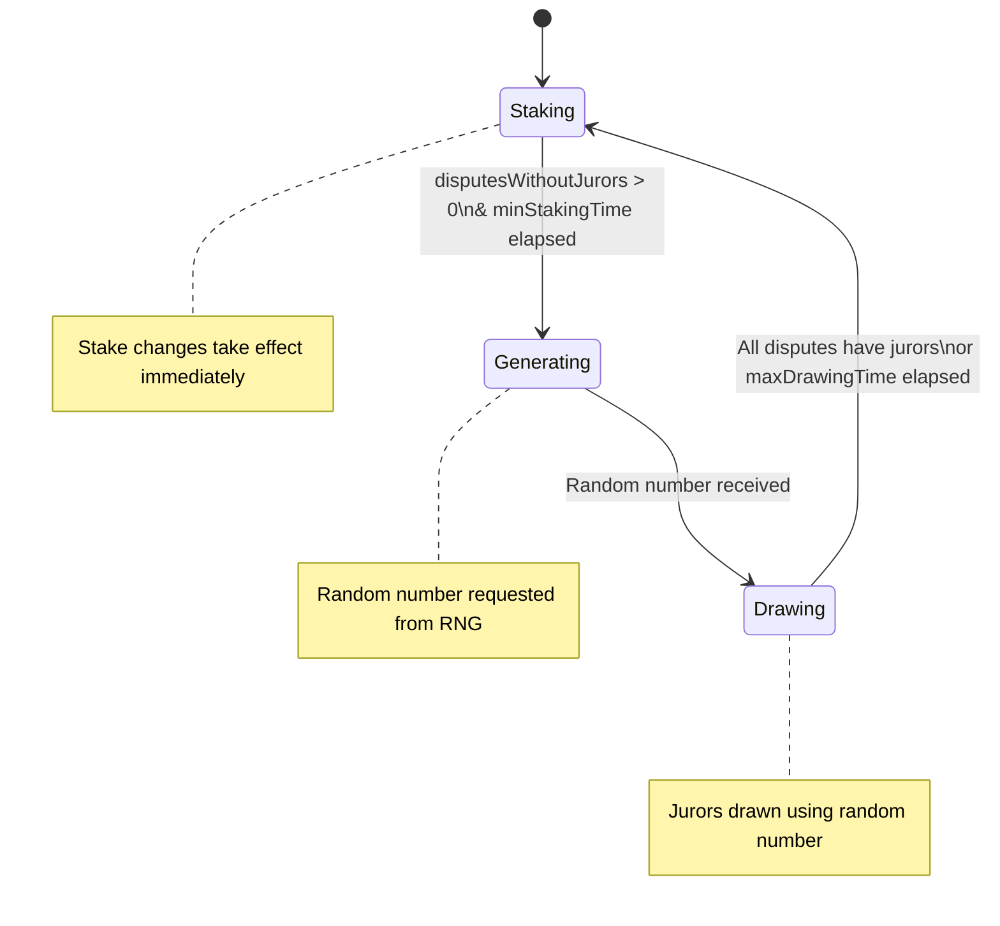

# How Kleros Court Works

Kleros Court resolves disputes through a structured process that ensures fairness, transparency, and economic alignment. This page walks through each stage from dispute creation to final execution.

---

## The Dispute Lifecycle



<Steps>
  <Step title="Dispute Creation">
    An arbitrable application encounters a contentious situation and needs resolution.

    - The application calls `createDispute()` on KlerosCore, providing case details
    - Arbitration fees are paid to incentivize jurors (the protocol takes no commission)
    - Court selection and juror count are specified through the `extraData` parameter
    - A dispute template defines the question and choices presented to jurors
    - The dispute enters the **Evidence Period**
  </Step>

  <Step title="Evidence Period">
    Both parties submit evidence to support their case.

    - Evidence can include text explanations, documents, images, or other materials
    - Evidence metadata (name, description, file URI) is emitted as an **`Evidence` event** on-chain, with the actual files stored on **IPFS** via the Atlas provider
    - Anyone can submit evidence during this period — not just the disputing parties
    - The dispute template defines what information jurors need to see

    <Note>Evidence URIs are recorded on-chain via events for transparency, but the files themselves are stored off-chain on IPFS. This keeps gas costs manageable while maintaining a permanent, verifiable record.</Note>
  </Step>

  <Step title="Juror Selection">
    Jurors are randomly drawn from those who have staked PNK in the relevant court.

    - Selection probability is proportional to the amount of PNK staked
    - The Sortition Module uses a **three-phase system** to prevent manipulation (see below)
    - A portion of each drawn juror's stake is locked as collateral (`pnkAtStakePerJuror`)
    - All required jurors must be drawn before proceeding
    - A juror can be drawn multiple times for the same dispute (their weight increases accordingly)
  </Step>

  <Step title="Voting Period">
    Jurors review evidence and cast their votes.

    **When `hiddenVotes = true` (Commit-Reveal):**

    - **Commit Phase**: Jurors submit a hash of their vote + a secret salt. Votes remain hidden.
    - **Reveal Phase**: Jurors return to reveal their actual vote with justification. Failure to reveal results in losing locked PNK.

    **When `hiddenVotes = false`:**

    - Jurors vote directly in a single transaction. Votes are visible immediately.

    The winning option is determined by **plurality** — the choice with the most votes wins.
  </Step>

  <Step title="Appeal Period">
    Parties can challenge the outcome if dissatisfied.

    - Anyone can fund an appeal to support a particular side
    - The opposing side can counter-fund to defend the original outcome
    - Appeals increase the number of jurors (doubling plus one: `n×2 + 1`)
    - Large or contentious cases may jump to a parent court when the juror count exceeds the `jurorsForCourtJump` threshold

    See [Appeals](/court/appeals) for the full mechanics.
  </Step>

  <Step title="Execution">
    Once appeals are exhausted, the ruling becomes final.

    - KlerosCore calls `rule()` on the original arbitrable application
    - Coherent jurors (who voted with the winning plurality) receive rewards
    - Incoherent jurors lose a portion of their staked PNK
    - The ruling is enforced automatically by the smart contract
  </Step>
</Steps>

---

## The Phase System

The Sortition Module uses a three-phase cycle to prevent manipulation of juror selection. A bot triggers phase transitions by calling `passPhase()`.



<Tabs>
  <Tab title="Staking Phase">
    **Best time to adjust your stakes**

    - Stake changes take effect immediately and update the sortition sum tree
    - Jurors can add, remove, or redistribute their stakes across courts
    - Duration varies based on dispute activity (minimum: `minStakingTime`)
    - Phase transitions to Generating when there are disputes waiting for jurors
  </Tab>
  <Tab title="Generating Phase">
    **Random number being generated**

    - A random number is requested from the RNG provider
    - The random number becomes available after `rngLookahead` blocks
    - Stake changes made during this phase are **delayed** — they won't apply until the next Staking phase
  </Tab>
  <Tab title="Drawing Phase">
    **Jurors being selected**

    - Jurors are drawn using the random number and current stake distribution
    - Stake changes remain delayed
    - Continues until all disputes have jurors or `maxDrawingTime` elapses
    - Each draw selects a juror proportional to their stake weight in the sortition sum tree
  </Tab>
</Tabs>

<Warning>If you stake during the Generating or Drawing phases, your changes won't affect current selection chances. The Court UI shows whether your stakes are "Current" or "Delayed."</Warning>

---

## Dispute Kits

Kleros V2 introduces modular dispute resolution through pluggable Dispute Kits. Each court specifies which kits it supports, and every court must support the **Classic Dispute Kit** as a universal fallback.

| Kit | Description | Status |
| --- | --- | --- |
| **Classic** | Plurality voting where the option with the most votes wins. Universal fallback — every court must support it. | Live |
| **Shutter-Enabled** | Threshold encryption for enhanced vote privacy. Single-transaction voting with automatic decryption. | In development |

<Note>The dispute kit architecture is designed to be extensible. Additional kits (ranked choice, PoH-gated, etc.) can be added through governance as the protocol evolves. When creating disputes, arbitrable applications specify a dispute kit ID in `extraData`.</Note>

---

## Voting Mechanics

### Current: Commit-Reveal

Courts with `hiddenVotes = true` use the commit-reveal pattern to prevent jurors from copying each other's votes:

<Steps>
  <Step title="Commit Phase">
    Choose your vote, generate a random salt, and submit `keccak256(choiceID, salt, justification)` as your commitment. Keep your salt safe — you'll need it to reveal.
  </Step>
  <Step title="Reveal Phase">
    Return and submit your actual vote, salt, and justification. The contract verifies the hash matches your commitment. Failure to reveal means losing your locked PNK.
  </Step>
</Steps>

### Future: Shutter Encrypted Voting

Shutter Network integration will replace the two-transaction commit-reveal with a single-transaction encrypted voting flow:

- Jurors submit encrypted votes in one transaction
- Votes are encrypted using **threshold cryptography** — no single party can decrypt early
- Automatic decryption occurs when the voting period ends
- No manual reveal required, eliminating the risk of forgetting to reveal
- Prevents vote copying and bandwagon effects more robustly than commit-reveal

<Info>Shutter integration has been tested on testnet. Check the [Kleros blog](https://blog.kleros.io) for the latest status on production deployment.</Info>

---

## Rewards and Penalties

### For Coherent Jurors (voted with the winning plurality)

You receive rewards from two sources:

1. **Arbitration Fees**: ETH (or whitelisted ERC-20 tokens) paid by dispute creators, divided among coherent jurors
2. **PNK Redistribution**: PNK penalties from incoherent jurors, divided among coherent jurors

**Reward Formula:**

```
jurorReward = (totalFees / numberOfCoherentVotes) × degreeOfCoherence
pnkReward  = (totalPenalties / numberOfCoherentVotes) × degreeOfCoherence
```

The `degreeOfCoherence` is calculated by the dispute kit and ranges from 0 to `ALPHA_DIVISOR` (10,000). In the Classic Dispute Kit, jurors who voted with the plurality receive full coherence.

### For Incoherent Jurors (voted against the winning plurality)

- Lose a portion of staked PNK (determined by the court's `alpha` parameter)
- Forfeit arbitration fee rewards for that round

<Accordion title="Reward Example">
**Scenario:** A case has 3 jurors with a fee of 0.005 ETH per juror (total: 0.015 ETH). 2 jurors vote coherently, 1 votes incoherently.

**Each coherent juror receives:**
- ETH: 0.015 ÷ 2 = 0.0075 ETH
- PNK: (1 × locked PNK amount) ÷ 2

**The incoherent juror loses:**
- Their locked PNK (determined by `alpha` × `minStake` / 10000)
- Their share of arbitration fees
</Accordion>

---

## Staking Rewards (KIP-66)

[KIP-66](https://forum.kleros.io) is a community-approved governance proposal that introduces additional staking rewards beyond traditional arbitration fees. The mechanism is implemented in the smart contracts.

<Info>Check the [Kleros blog](https://blog.kleros.io) or [Snapshot](https://snapshot.box/#/s:kleros.eth) for the latest status on whether KIP-66 staking rewards are currently active.</Info>

---

## Security Features

### RNG System

The Sortition Module uses a generic `RNG` interface for random number generation, with a configurable `rngLookahead` parameter that sets the minimum block distance between requesting and receiving a random number. This helps prevent manipulation by ensuring the random seed cannot be predicted at the time of the request.

The system includes fallback behavior: if the Drawing phase exceeds `maxDrawingTime` without completing, the phase automatically transitions back to Staking to prevent the system from getting stuck.

### Juror Integrity Protections

- **Pre-reveal protection**: In commit-reveal courts, if a juror reveals their vote before the reveal phase, anyone can report them. The reporter can claim a portion of the juror's locked stake as a reward.
- **Coordination disincentives**: The commit-reveal and future Shutter-based voting mechanisms are specifically designed to prevent jurors from seeing each other's votes, making coordination difficult. Evidence of coordination can be reported through the governance process.

<Warning>Never share your vote choice before the reveal phase, and never coordinate with other jurors. Doing so undermines the Schelling point mechanism and puts your staked PNK at risk.</Warning>

---

## What's Next?

<CardGroup cols={3}>
  <Card title="Court Hierarchy" icon="sitemap" href="/court/court-hierarchy">
    Understand court structure and specialization
  </Card>
  <Card title="Appeals" icon="arrow-up-right-from-square" href="/court/appeals">
    Learn how appeals and escalation work
  </Card>
  <Card title="Become a Juror" icon="user-plus" href="https://blog.kleros.io/kleros-2-0-juror-101/">
    Step-by-step staking and voting guide
  </Card>
</CardGroup>