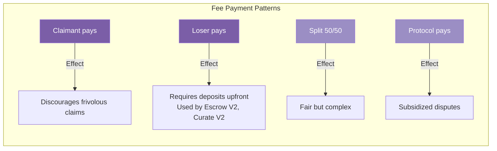
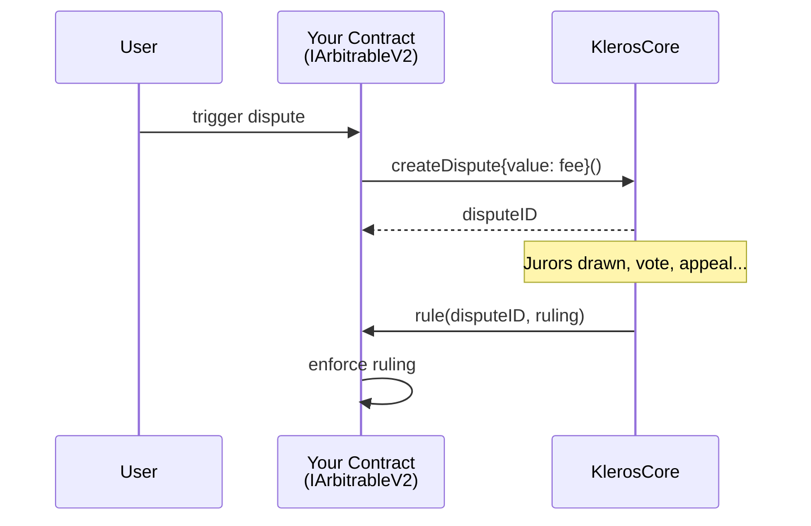
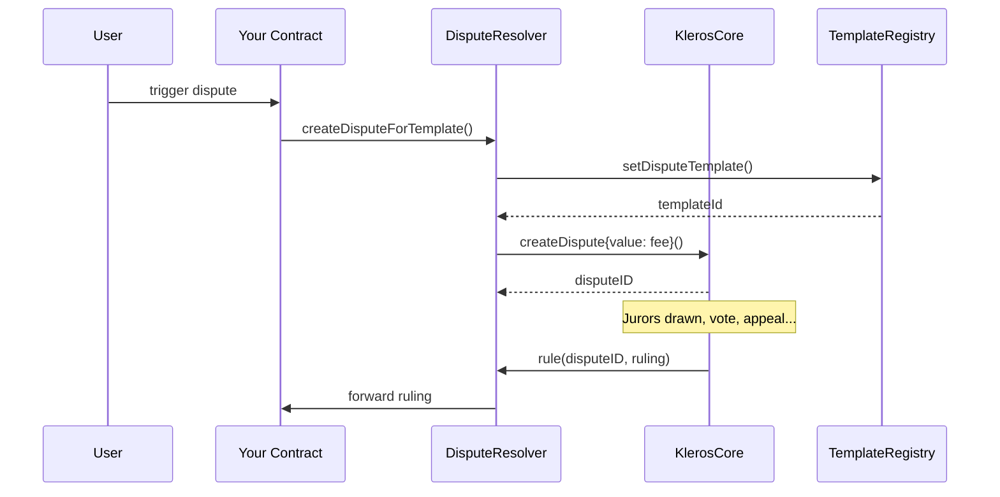
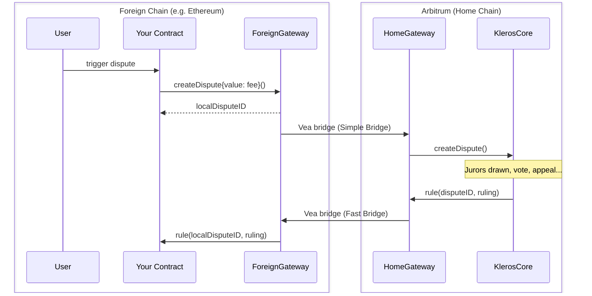

## What is an Arbitrable Contract?

An arbitrable contract is any smart contract that can create disputes and enforce rulings from Kleros. Your contract implements the `IArbitrableV2` interface, which defines two things:

1. **How disputes are created** — your contract decides when conflicts arise
2. **How rulings are enforced** — your contract executes the outcome

Kleros handles everything in between: juror selection, voting, appeals, and determining the final ruling.

## When to Use Kleros Arbitration

<CardGroup cols={2}>
  <Card title="Good Fit" icon="check">
    - Subjective disputes humans can judge
    - High-value transactions worth the cost
    - Cases where trust is impossible
    - Multi-party disagreements
  </Card>
  <Card title="Poor Fit" icon="xmark">
    - Fully objective, on-chain verifiable outcomes
    - Micro-transactions (fees > value)
    - Time-critical decisions (< 1 week)
    - Disputes requiring real-world enforcement
  </Card>
</CardGroup>

## Key Design Decisions

Before writing code, decide on these:

### 1. Ruling Options

Define what jurors can decide. Common patterns:

| Pattern | Choices | Example |
|---------|---------|---------|
| Binary | 2 | Release funds: Yes / No |
| Multi-party | 3+ | Winner: Alice / Bob / Split |
| Graduated | N | Refund percentage: 0% / 25% / 50% / 75% / 100% |

<Note>
Choice `0` is reserved for "Refuse to Arbitrate" — jurors select this when the dispute is invalid or unanswerable.
</Note>

### 2. Who Pays Fees?

Arbitration costs ETH. Your contract decides who pays:



<Note>
Most Kleros products use **loser pays** — both parties deposit the arbitration fee upfront, and the winner is reimbursed. This is the pattern used by Escrow V2 and Curate V2.
</Note>

### 3. Dispute Triggers

When does a dispute start? Common triggers:

- **Explicit request** — Party calls `raiseDispute()`
- **Timeout** — No response within deadline
- **Challenge** — Someone disputes a pending action
- **Automatic** — Conflicting claims detected

### 4. Evidence Submission

Decide how evidence reaches jurors:

- **On-chain events** — Emit `Evidence` events from your contract
- **Separate module** — Use the `EvidenceModule` contract
- **Cross-chain** — Evidence from foreign chain via gateway

## Interface Requirements

Your contract must implement:

```solidity
interface IArbitrableV2 {
    /// @dev Emitted when a dispute is created
    event DisputeRequest(
        IArbitratorV2 indexed _arbitrator,
        uint256 indexed _arbitratorDisputeID,
        uint256 _externalDisputeID,
        uint256 _templateId,
        string _templateUri
    );
    
    /// @dev Emitted when a ruling is executed
    event Ruling(
        IArbitratorV2 indexed _arbitrator,
        uint256 indexed _disputeID,
        uint256 _ruling
    );
    
    /// @dev Called by arbitrator to deliver ruling
    function rule(uint256 _disputeID, uint256 _ruling) external;
}
```

## Architecture Patterns

### Pattern A: Direct Integration

Your contract is the arbitrable. Simplest approach.



### Pattern B: Proxy/Resolver

Use `DisputeResolver` as intermediary. Good for upgradability.



### Pattern C: Cross-Chain

Arbitrable on mainnet, resolution on Arbitrum.



## Cost Considerations

| Factor | Impact |
|--------|--------|
| Number of jurors | More jurors = higher fees, more security |
| Court selection | Specialized courts may cost more |
| Appeals | Each round roughly doubles cost |
| Evidence storage | IPFS/Arweave costs are separate |

<Tip>
Start with **3 jurors** in **General Court** for most disputes. Increase for high-value cases.
</Tip>

## Security Mindset

Your contract must handle:

- **Reentrancy** — `rule()` is an external call
- **Ruling validation** — Check ruling is within expected range
- **Duplicate rulings** — Prevent `rule()` being called twice
- **Fee changes** — Arbitration cost can change between calls
- **Arbitrator trust** — Only accept rulings from your arbitrator

## Next Steps

<Card title="Implementation Guide" icon="code" href="/developers/arbitrable/guide">
  Step-by-step walkthrough with complete code examples
</Card>