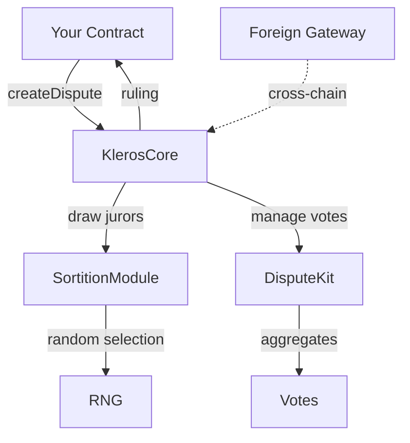
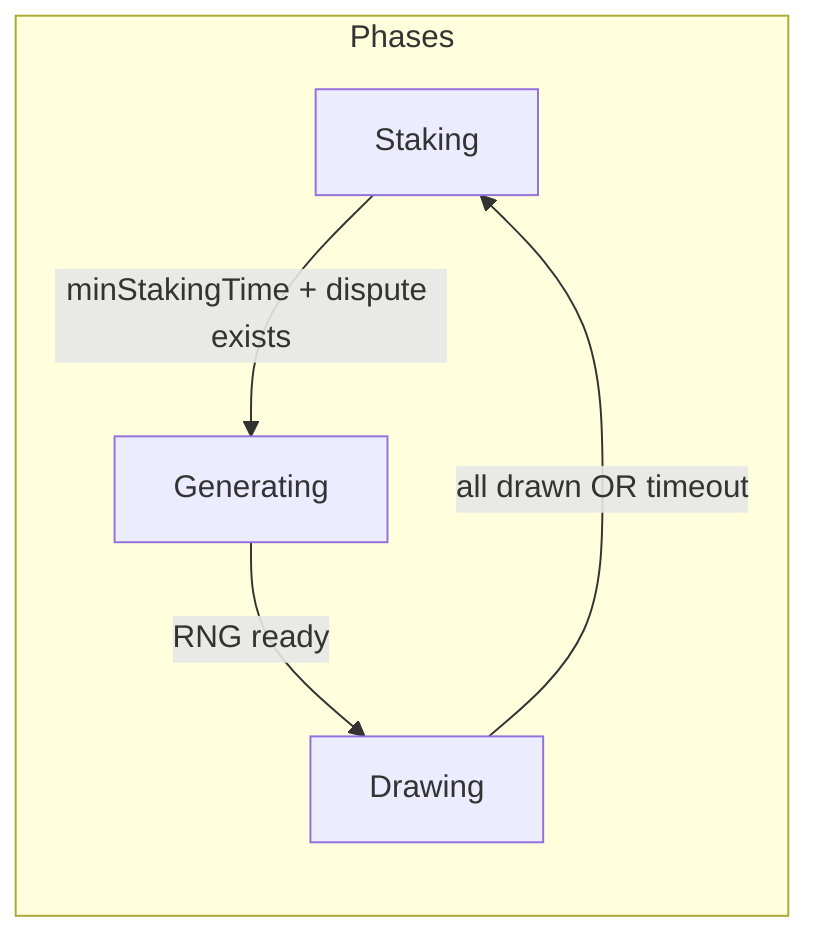
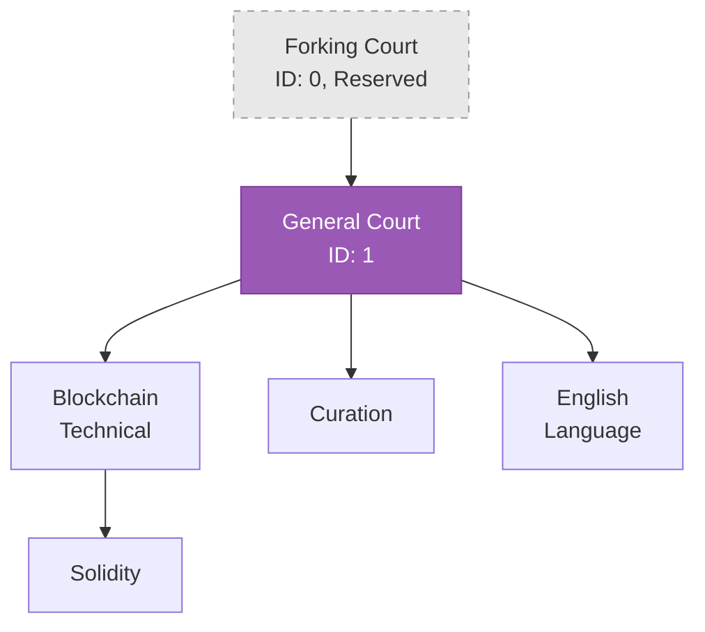
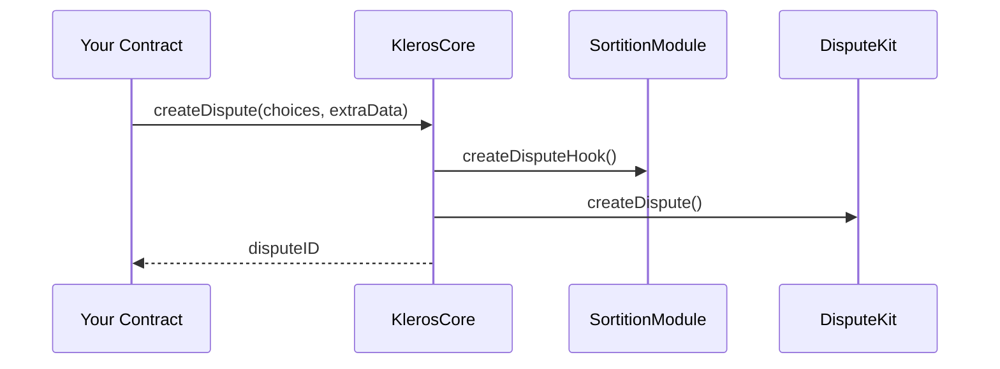
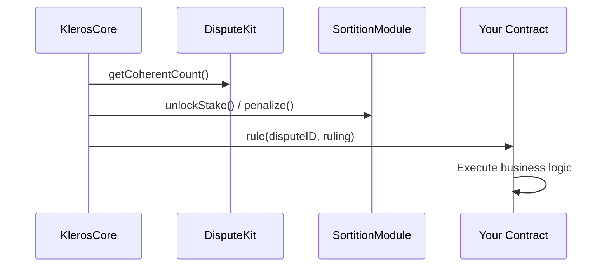

## System Overview

Kleros V2 uses a modular architecture where specialized contracts handle specific responsibilities:



## Core Components

### KlerosCore

The orchestrator. Manages the dispute lifecycle and coordinates between modules.

| Responsibility | Description |
|----------------|-------------|
| Dispute creation | Accepts disputes from arbitrable contracts |
| Period management | Moves disputes through evidence → vote → appeal → execution |
| Fee collection | Collects and distributes arbitration fees |
| Court configuration | Stores court parameters (timing, fees, stakes) |

```solidity
interface IArbitratorV2 {
    function createDispute(uint256 _choices, bytes calldata _extraData) 
        external payable returns (uint256 disputeID);
    
    function arbitrationCost(bytes calldata _extraData) 
        external view returns (uint256 cost);
    
    function currentRuling(uint256 _disputeID) 
        external view returns (uint256 ruling, bool tied, bool overridden);
}
```

### Sortition Module

Handles juror selection using weighted randomness.

**Key concepts:**
- **Sortition Tree**: Data structure mapping staked PNK to selection probability
- **Phases**: Staking → Generating → Drawing (prevents RNG manipulation)
- **Delayed Stakes**: Stake changes queue until the drawing phase completes



### Dispute Kits

Modular voting mechanisms. The protocol ships with **DisputeKitClassic** but supports custom implementations.

| Kit | Mechanism | Use Case |
|-----|-----------|----------|
| Classic | Plurality voting, proportional to stake | Default for all courts |
| Sybil Resistant | Requires Proof of Humanity | One-person-one-vote disputes |
| Gated | Requires token holdings | Specialized community disputes |

**Classic Dispute Kit features:**
- Commit-reveal voting (optional, per court)
- Coherence-based rewards (vote with majority = keep stake)
- Appeal crowdfunding

### Gateways (Cross-Chain)

Enable disputes from other chains to be resolved on Arbitrum.

```
[Ethereum Mainnet]          [Arbitrum One]
       │                          │
  Foreign Gateway ──bridge──► Home Gateway ──► KlerosCore
       │                          │
  Your Contract                Jurors Vote
```

**Flow:**
1. Arbitrable on mainnet calls Foreign Gateway
2. Message bridged to Home Gateway on Arbitrum
3. Dispute resolved on Arbitrum
4. Ruling bridged back to mainnet

## Dispute Lifecycle

<Steps>
  <Step title="Evidence Period">
    Parties submit evidence. Jurors are drawn via Sortition Module.
  </Step>
  <Step title="Commit Period (if enabled)">
    Jurors submit hidden vote commitments (hash of vote + salt).
  </Step>
  <Step title="Vote Period">
    Jurors reveal votes. Must match commitment if commit phase was used.
  </Step>
  <Step title="Appeal Period">
    Losing party can fund an appeal. More jurors drawn for next round.
  </Step>
  <Step title="Execution">
    Stakes redistributed. Coherent jurors rewarded, incoherent penalized. Ruling sent to arbitrable.
  </Step>
</Steps>

## Court Hierarchy

Courts form a tree. Appeals can "jump" to parent courts when juror count exceeds threshold.



**Court parameters:**
- `minStake`: Minimum PNK to stake
- `feeForJuror`: ETH fee per juror per round
- `jurorsForCourtJump`: Threshold to appeal to parent court
- `timesPerPeriod`: Duration of each dispute period

## Data Flow

### Creating a Dispute



### Executing a Ruling



## Security Model

| Mechanism | Purpose |
|-----------|---------|
| **Stake-weighted selection** | Sybil resistance — need PNK to participate |
| **Coherence incentives** | Vote with majority to keep stake, lose stake if incoherent |
| **Appeals** | Multiple rounds catch errors, increases cost of attacks |
| **Phase system** | Prevents RNG manipulation |
| **Guardian/Governor** | Emergency pause capability |

## Key Addresses (Arbitrum One)

| Contract | Purpose |
|----------|---------|
| KlerosCore | Main arbitrator |
| SortitionModule | Juror selection |
| DisputeKitClassic | Default voting |
| DisputeTemplateRegistry | Template storage |
| EvidenceModule | Evidence tracking |

<Note>
For current addresses, check the [kleros-v2 deployment files](https://github.com/kleros/kleros-v2/tree/dev/contracts/deployments).
</Note>

## Further Reading

- [Arbitrable Interface](/developers/specs/arbitrable) — Full interface specification
- [Dispute Kits](/developers/specs/dispute-kit) — Custom voting mechanisms
- [Sortition Module](/developers/specs/sortition) — Juror selection deep dive