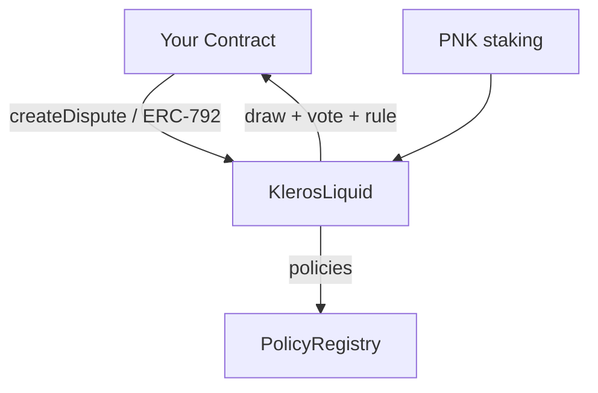
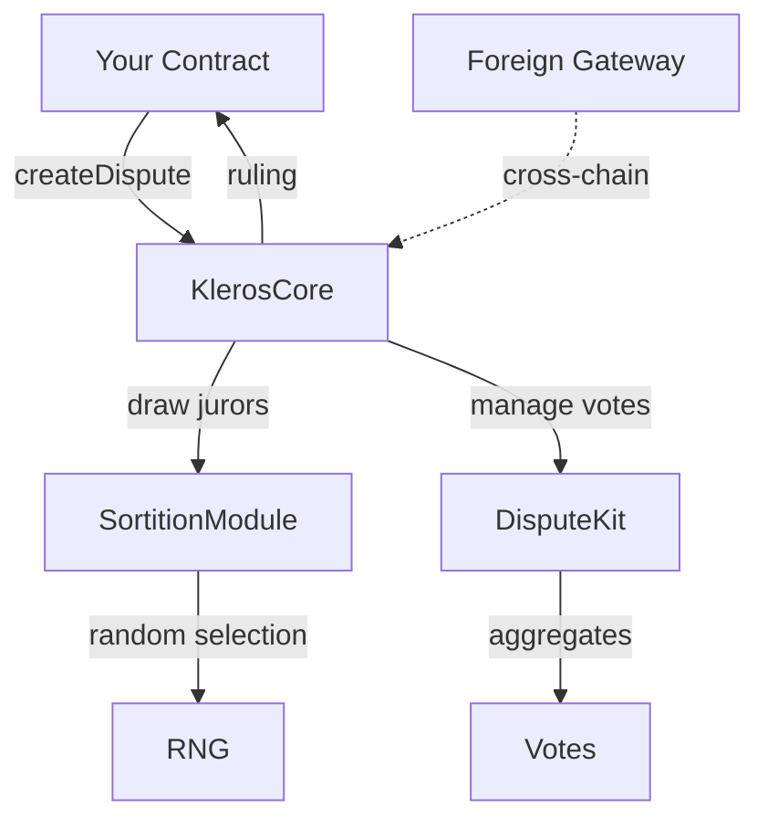
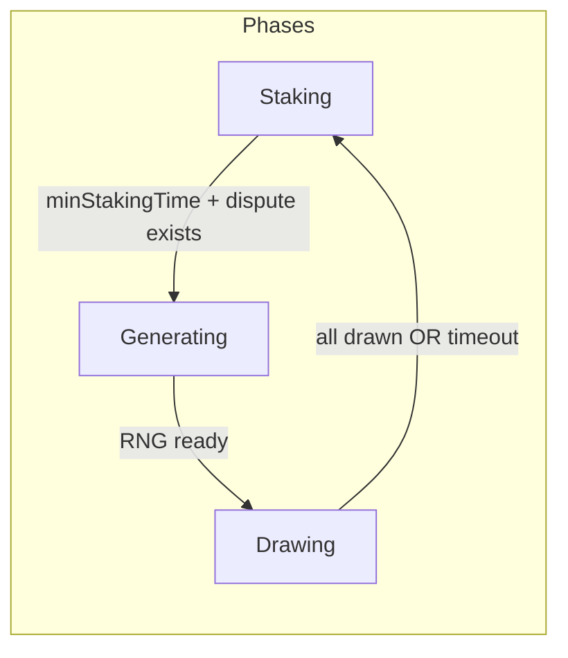
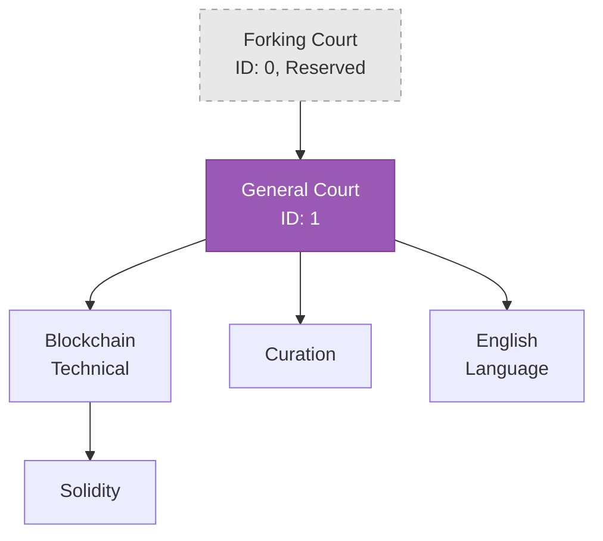
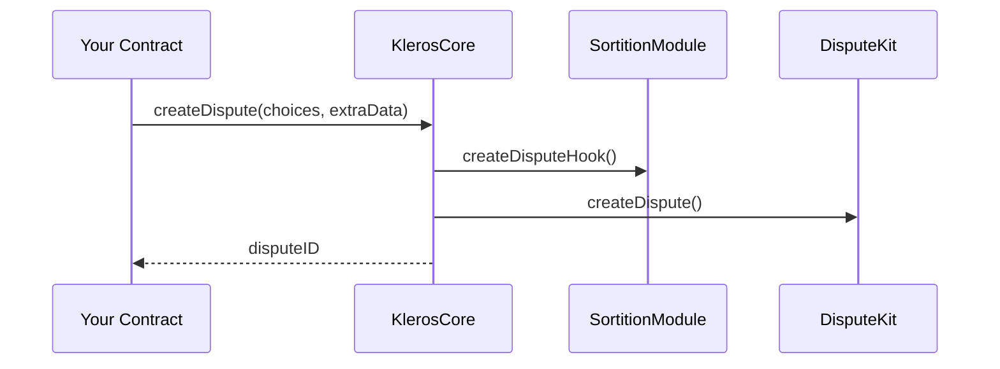
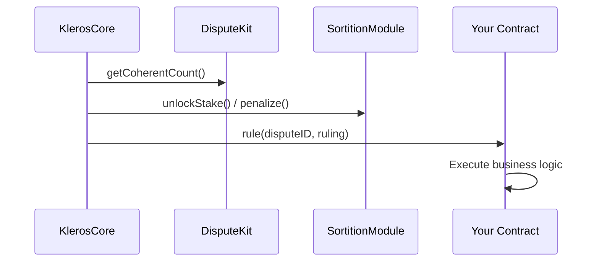

Kleros runs on two protocol versions. This page covers both: V1 first, then the V2 component architecture in detail.

## V1 Architecture

Court V1 is built around a single contract, **KlerosLiquid**, on Ethereum Mainnet and Gnosis Chain. It is monolithic: staking, juror drawing, voting, appeals, and ruling execution all live in one contract.


```mermaid
graph TB
    Arbitrable[Your Contract] -->|createDispute / ERC-792| KlerosLiquid
    KlerosLiquid -->|draw + vote + rule| Arbitrable
    KlerosLiquid -->|policies| PolicyRegistry
    PNK[PNK staking] --> KlerosLiquid
```

| Component | Role |
| --- | --- |
| **KlerosLiquid** | Staking, juror drawing, voting, appeals, ruling execution |
| **PNK** | Staking token |
| **PolicyRegistry** | Court policy storage |
| **Arbitrable contracts** | Implement ERC-792 to create disputes and receive rulings |

V1 uses the ERC-792 (arbitration) and ERC-1497 (evidence) standards, blockhash-based randomness, commit-reveal plurality voting, and a hierarchical subcourt tree. For V1 contract addresses, see [Deployment Addresses](/reference/contracts/deployment-addresses-v1).

## V2 System Overview

Kleros V2 uses a modular architecture where specialized contracts handle specific responsibilities:


```mermaid
graph TB
    Arbitrable[Your Contract] -->|createDispute| KlerosCore
    KlerosCore -->|draw jurors| SortitionModule
    KlerosCore -->|manage votes| DisputeKit
    KlerosCore -->|ruling| Arbitrable
    
    SortitionModule -->|random selection| RNG
    DisputeKit -->|aggregates| Votes
    
    Gateway[Foreign Gateway] -.->|cross-chain| KlerosCore
```

## Core Components

### KlerosCore

The orchestrator. Manages the dispute lifecycle and coordinates between modules.

| Responsibility | Description |
|----------------|-------------|
| Dispute creation | Accepts disputes from arbitrable contracts |
| Period management | Moves disputes through evidence → vote → appeal → execution |
| Fee collection | Collects and distributes arbitration fees |
| Court configuration | Stores court parameters (timing, fees, stakes) |

```solidity
interface IArbitratorV2 {
    function createDispute(uint256 _choices, bytes calldata _extraData) 
        external payable returns (uint256 disputeID);
    
    function arbitrationCost(bytes calldata _extraData) 
        external view returns (uint256 cost);
    
    function currentRuling(uint256 _disputeID) 
        external view returns (uint256 ruling, bool tied, bool overridden);
}
```

### Sortition Module

Handles juror selection using weighted randomness.

**Key concepts:**
- **Sortition Tree**: Data structure mapping staked PNK to selection probability
- **Phases**: Staking → Generating → Drawing (prevents RNG manipulation)
- **Delayed Stakes**: Stake changes queue until the drawing phase completes

Sortition tree simplification is queued as the next piece of contract simplification work (May 2026), and a reworked reward staking mechanism is in planning (May 2026).


```mermaid
graph LR
    subgraph Phases
        S[Staking] -->|minStakingTime + dispute exists| G[Generating]
        G -->|RNG ready| D[Drawing]
        D -->|all drawn OR timeout| S
    end
```

### Dispute Kits

Modular voting mechanisms. The protocol ships with **DisputeKitClassic** but supports custom implementations.

| Kit | Mechanism | Use Case |
|-----|-----------|----------|
| Classic | Plurality voting, proportional to stake | Default for all courts |
| Sybil Resistant | Requires Proof of Humanity | One-person-one-vote disputes |
| Gated | Requires token holdings | Specialized community disputes |

**Classic Dispute Kit features:**
- Commit-reveal voting (optional, per court)
- Coherence-based rewards (vote with majority = keep stake)
- Appeal crowdfunding

**Development status:** Court V2 contracts went through four internal review rounds (Rounds 1–4, September–November 2025), then an external audit by Certora (December 2025–January 2026), with audit responses submitted in January 2026. Internal review completed in April 2026, with findings triaged. Contract simplification across dispute kits was merged (June 2026), and a partial-coherence dispute kit was merged (May 2026). The forking court specification progressed from draft to governance-level discussion (May–June 2026), and the forking dispute kit moved from in-progress to draft (June 2026).

<Note>
Because contract simplification continued after the Certora audit (December 2025–January 2026), the audit does not cover the final version of the contracts.
</Note>

**Specialized dispute kits** include the Argentina Consumer Protection DK (gated, SBT-based), a University DK, and a Shutter DK (commit/reveal with threshold encryption via the Shutter Network).

### Gateways (Cross-Chain)

Enable disputes from other chains to be resolved on Arbitrum.

```
[Ethereum Mainnet]          [Arbitrum One]
       │                          │
  Foreign Gateway ──bridge──► Home Gateway ──► KlerosCore
       │                          │
  Your Contract                Jurors Vote
```

**Flow:**
1. Arbitrable on mainnet calls Foreign Gateway
2. Message bridged to Home Gateway on Arbitrum
3. Dispute resolved on Arbitrum
4. Ruling bridged back to mainnet

Recent cross-chain development (see [Vea Bridge](/developers/crosschain/vea-bridge) for details): the VeaShi package was created to package Hashi and Vea contracts for consumption by Kleros V2 (March 2026); deBridge was added as a second bridge protocol alongside LayerZero (February 2026); the Hashi executor was made chain-agnostic (January 2026); `veashi-sdk` was published to npm as `@kleros/veashi-sdk` v0.0.2 (May 2026); new Base ↔ Ethereum and Base ↔ Arbitrum routes were added (June 2026); a three-oracle approach for VeaShi was adopted, with LayerZero and Chainlink CCIP as the two primary oracles and deBridge or Wormhole as a third slot (June 2026); the Envio HyperIndex indexer was integrated into the VeaShi scanner (June 2026); and a second validator became operational (February 2026).

### Atlas (internal backend)

<Note>
Atlas is an internal backend library for Kleros development teams only. It is not intended for community use or integration.
</Note>

Atlas is the notification and backend services layer. It handles email notifications, IPFS uploads (SIWE-authenticated), keeper bots, and data streaming. It reached v1.6.0 by May 2026. Key capabilities include per-product signup (Court V1, Court V2, Foresight), configurable vote reminders, SendGrid delivery tracking, and PoH V2 email notifications.

### Components Library (kleros-app)

A shared UI components library is used by all V2 frontends. `kleros-app` v3.0.1 shipped in June 2026 with product differentiation between signup and IPFS and unsubscribe support, and the file viewer was extracted as a shared component (June 2026).

## Dispute Lifecycle

<Steps>
  <Step title="Evidence Period">
    Parties submit evidence. Jurors are drawn via Sortition Module.
  </Step>
  <Step title="Commit Period (if enabled)">
    Jurors submit hidden vote commitments (hash of vote + salt).
  </Step>
  <Step title="Vote Period">
    Jurors reveal votes. Must match commitment if commit phase was used.
  </Step>
  <Step title="Appeal Period">
    Losing party can fund an appeal. More jurors drawn for next round.
  </Step>
  <Step title="Execution">
    Stakes redistributed. Coherent jurors rewarded, incoherent penalized. Ruling sent to arbitrable.
  </Step>
</Steps>

## Court Hierarchy

Courts form a tree. Appeals can "jump" to parent courts when juror count exceeds threshold.


```mermaid
flowchart TD
    FC[Forking Court<br/>ID: 0, Reserved] --> GC[General Court<br/>ID: 1]
    GC --> BT[Blockchain<br/>Technical]
    GC --> CU[Curation]
    GC --> EL[English<br/>Language]
    BT --> SO[Solidity]
    
    style FC fill:#e8e8e8,stroke:#999,stroke-dasharray:5 5
    style GC fill:#9b59b6,stroke:#7d3c98,color:#fff
```

**Court parameters:**
- `minStake`: Minimum PNK to stake
- `feeForJuror`: ETH fee per juror per round
- `jurorsForCourtJump`: Threshold to appeal to parent court
- `timesPerPeriod`: Duration of each dispute period

## Data Flow

### Creating a Dispute


```mermaid
sequenceDiagram
    participant A as Your Contract
    participant K as KlerosCore
    participant S as SortitionModule
    participant D as DisputeKit

    A->>K: createDispute(choices, extraData)
    K->>S: createDisputeHook()
    K->>D: createDispute()
    K-->>A: disputeID
```

### Executing a Ruling


```mermaid
sequenceDiagram
    participant K as KlerosCore
    participant D as DisputeKit
    participant S as SortitionModule
    participant A as Your Contract

    K->>D: getCoherentCount()
    K->>S: unlockStake() / penalize()
    K->>A: rule(disputeID, ruling)
    A->>A: Execute business logic
```

## Security Model

| Mechanism | Purpose |
|-----------|---------|
| **Stake-weighted selection** | Sybil resistance need PNK to participate |
| **Coherence incentives** | Vote with majority to keep stake, lose stake if incoherent |
| **Appeals** | Multiple rounds catch errors, increases cost of attacks |
| **Phase system** | Prevents RNG manipulation |
| **Guardian/Governor** | Emergency pause capability |

### Audits and security work

- Court V2 contracts went through four internal review rounds plus an external Certora audit (see Dispute Kits above for the timeline and the note on audit coverage).
- Frontend security audits were conducted across all V1, V2, and PoH frontends, with an XSS attack-vector review (June 2026).
- React vulnerabilities (CVE-55183, CVE-55184, CVE-67779) were patched across multiple applications in a coordinated effort (December 2025).
- The bug bounty program is migrating from Hats Finance (shut down) to alternative platforms.
- Kleros Skills launched at [skills.kleros.io](https://skills.kleros.io) - agent-readable knowledge packs for the protocol (May 2026). Packs available: IPFS Upload and Curate operations. Roadmap: CLI, ERC-8004 agent verification, Escrow v1/v2, and an Arbitrable App Builder.

## Key Addresses (Arbitrum One)

| Contract | Purpose |
|----------|---------|
| KlerosCore | Main arbitrator |
| SortitionModule | Juror selection |
| DisputeKitClassic | Default voting |
| DisputeTemplateRegistry | Template storage |
| EvidenceModule | Evidence tracking |

<Note>
For current addresses, check the [kleros-v2 deployment files](https://github.com/kleros/kleros-v2/tree/dev/contracts/deployments).
</Note>

