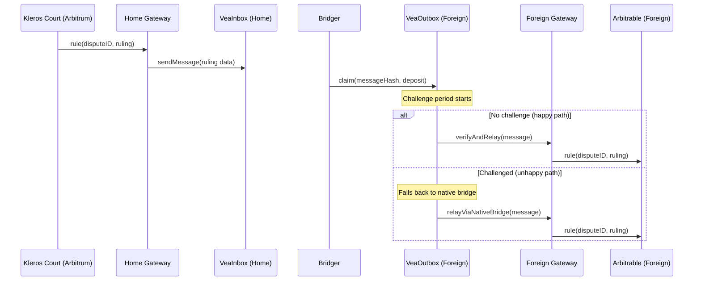

## Overview

Vea is a general-purpose cross-chain message bridge developed by Kleros. It enables faster bridging than native rollup bridges by using a trust-minimized fraud-proof game. In the Kleros protocol, Vea handles two critical message types:

- **Dispute creation** — Arbitrable contracts on foreign chains send dispute requests to Kleros Court on Arbitrum (Foreign → Home)
- **Ruling relay** — Kleros Court sends finalized rulings back to arbitrable contracts on foreign chains (Home → Foreign)

Vea is the bridge layer that connects the [Foreign Gateway](/developers/crosschain/l2-integration) and [Home Gateway](/developers/architecture) contracts.

---

## Architecture

Vea uses different bridge primitives depending on the message direction and security requirements:

| Bridge Type | Direction | Mechanism |
| --- | --- | --- |
| **Simple Bridge** | Foreign → Home (dispute creation) | Direct relay via gateways. No fraud-proof game because a malicious dispute only wastes the attacker's gas. |
| **Fast Bridge** | Home → Foreign (ruling relay) | Trust-minimized bridge with deposit-backed claims and a challenge period. Falls back to native bridge only when a claim is challenged. |
| **Safe Bridge** | Fallback | Thin wrapper around the native rollup bridge (e.g., Arbitrum → Ethereum). Used when Fast Bridge claims are challenged. |

### Fast Bridge Flow



---

## Participants

| Role | Behavior |
| --- | --- |
| **Bridger** | Actively relays messages from the home chain by making deposit-backed claims on the foreign chain. Only one honest bridger is required. |
| **Challenger** | Monitors claims on the foreign chain. Submits a challenge only when witnessing a dishonest claim. Does not propose a correct answer — the correct message comes from the native bridge. |
| **Relayer** | Verifies that the challenge period has passed without challenge, then calls `verifyAndRelay()` to deliver the message. |

### Incentive Structure

- If the Challenger wins, they earn the Bridger's deposit
- If the Bridger wins, they earn the Challenger's deposit
- The loser forfeits their deposit

---

## Supported Routes

| Route | Direction | Bridge Type |
| --- | --- | --- |
| Arbitrum → Ethereum | Home → Foreign | Fast Bridge |
| Ethereum → Arbitrum | Foreign → Home | Simple Bridge |
| Arbitrum → Gnosis Chain | Home → Foreign | Fast Bridge (multi-hop: Arbitrum → Ethereum → Gnosis via two Safe Bridges in unhappy path) |

<Note>
  Vea does not rely on a direct native bridge between Arbitrum and Gnosis Chain. In the unhappy path, challenged claims are resolved using two Safe Bridges: Arbitrum → Ethereum Mainnet, then Ethereum Mainnet → Gnosis Chain.
</Note>

---

## Contract Components

### VeaInbox (Home Chain — Arbitrum)

Deployed on the home chain. Accepts outgoing messages from the Home Gateway and batches them for bridging.

```solidity
/// @dev Send a message to the foreign chain.
function sendMessage(address _to, bytes4 _fnSelector, bytes memory _data) external;
```

### VeaOutbox (Foreign Chain)

Deployed on each foreign chain. Receives claims from bridgers and manages the challenge period.

```solidity
/// @dev Make a claim about a message hash with a deposit.
function claim(bytes32 _messageHash) external payable;

/// @dev Challenge a pending claim.
function challenge(bytes32 _messageHash) external payable;

/// @dev Verify and relay a message after the challenge period.
function verifyAndRelay(bytes memory _message) external;
```

---

## VeaScan

[VeaScan](https://veascan.io) is the block explorer for Vea bridge transactions. It displays pending claims, challenge status, and relay history.

---

## Resources

<CardGroup cols={2}>
  <Card title="Vea GitHub" icon="github" href="https://github.com/kleros/vea">
    Bridge contract source code
  </Card>
  <Card title="VeaScan Explorer" icon="magnifying-glass" href="https://veascan.io">
    Bridge transaction explorer
  </Card>
  <Card title="Architecture Spec" icon="file" href="/developers/architecture">
    Full V2 architecture documentation
  </Card>
  <Card title="L2 Integration Guide" icon="link" href="/developers/crosschain/l2-integration">
    Integrate from a foreign chain
  </Card>
</CardGroup>