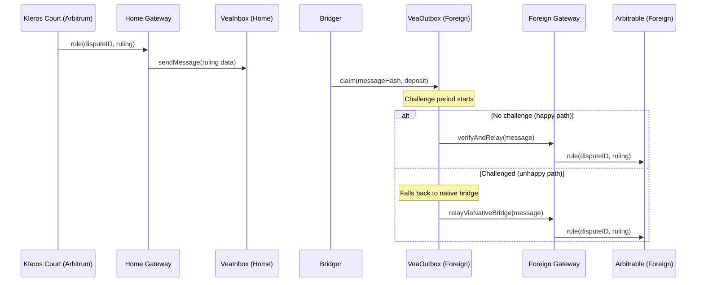

## Overview

Vea is a cross-chain message bridge built by Kleros for fast and secure interoperability with optimistic rollups. It solves a specific problem: bridging **authenticated data** across chains, where no third party can "supply liquidity" the way token bridges do.

In the Kleros protocol, Vea handles two message types:

- **Dispute creation** from foreign chains to Kleros Court on Arbitrum (Foreign to Home)
- **Ruling relay** from Kleros Court back to arbitrable contracts on foreign chains (Home to Foreign)

Vea connects the [Foreign Gateway](/reference/contracts/gateways) and Home Gateway contracts.

<Info>
For the full Vea protocol documentation including technical deep-dive, SDK reference, and validator guide, see [docs.vea.ninja](https://docs.vea.ninja/).
</Info>

---

## Security Properties

Vea differs from most cross-chain bridges in several ways:

- **1-of-N security**: Only one honest participant is needed to force correct bridge execution. The protocol is permissionless, so anyone can be that participant.
- **Immutable contracts**: No governance, no multisig, no upgradability risk.
- **No tokens, no fees, no rent-seeking**: Vea is a public good primitive.
- **Falls back to native bridges**: In the unhappy path, the native rollup bridge (operated by the rollup provider) serves as the source of truth.

---

## Bridge Types

Vea uses different bridge primitives depending on the message direction and security requirements:

| Bridge Type | Direction | Mechanism |
| --- | --- | --- |
| **Simple Bridge** | Foreign to Home (dispute creation) | Direct relay via gateways. No fraud-proof game needed because a malicious dispute only wastes the attacker's gas. |
| **Fast Bridge** | Home to Foreign (ruling relay) | Trust-minimized bridge with deposit-backed claims and a challenge period. Falls back to native bridge only when challenged. |
| **Safe Bridge** | Fallback | Thin wrapper around the native rollup bridge (e.g., Arbitrum to Ethereum). Used when Fast Bridge claims are challenged. |

---

## Fast Bridge Flow


```mermaid
sequenceDiagram
    participant Court as Kleros Court (Arbitrum)
    participant HG as Home Gateway
    participant VI as VeaInbox (Home)
    participant Bridger
    participant VO as VeaOutbox (Foreign)
    participant FG as Foreign Gateway
    participant App as Arbitrable (Foreign)

    Court->>HG: rule(disputeID, ruling)
    HG->>VI: sendMessage(ruling data)
    Bridger->>VO: claim(messageHash, deposit)
    Note over VO: Challenge period starts
    alt No challenge (happy path)
        VO->>FG: verifyAndRelay(message)
        FG->>App: rule(disputeID, ruling)
    else Challenged (unhappy path)
        Note over VO: Falls back to native bridge
        VO->>FG: relayViaNativeBridge(message)
        FG->>App: rule(disputeID, ruling)
    end
```

### Happy Path

Messages are optimistically verified. Bridging takes hours to a couple of days depending on the source and destination chain. No native bridge is involved. Gas is paid on the destination chain only.

### Unhappy Path

If a claim is challenged, the message is sent over the canonical bridge. This can take 7-8 days when sent from optimistic rollups. The dishonest party (either Bridger or Challenger) loses their deposit. Half is burned, half goes to the winning party. The mandatory burn prevents a zero-cost delay-grief attack where Bridger and Challenger are the same entity.

---

## Participants

| Role | Description |
| --- | --- |
| **Bridger** | Makes deposit-backed claims on the receiving chain about the state of messages on the sending chain. Competes for first claim per message. |
| **Challenger** | Monitors claims. Submits a challenge deposit when a dishonest claim is observed. Does not propose a correct answer; the native bridge provides ground truth. |
| **Relayer** | Waits until the challenge period passes, then calls `verifyAndRelay()` to deliver the message to its recipient. |

---

## Supported Routes

| Route | Direction | Bridge Type |
| --- | --- | --- |
| Arbitrum to Ethereum | Home to Foreign | Fast Bridge |
| Ethereum to Arbitrum | Foreign to Home | Simple Bridge |
| Arbitrum to Gnosis Chain | Home to Foreign | Fast Bridge (multi-hop via Ethereum in unhappy path) |

<Note>
Vea does not rely on a direct native bridge between Arbitrum and Gnosis Chain. In the unhappy path, challenged claims are resolved using two Safe Bridges: Arbitrum to Ethereum Mainnet, then Ethereum Mainnet to Gnosis Chain.
</Note>

---

## Contract Components

For each sending-receiving chain pair, there is a separate set of Vea contract deployments with exactly one contract per chain.

### VeaInbox (Sending Chain)

Manages the state of all messages sent through Vea. Messages are inserted into an append-only merkle tree (merkle mountain range). Deployed on the home chain (Arbitrum).

```solidity
function sendMessage(address _to, bytes4 _fnSelector, bytes memory _data) external;
```

### Router (Intermediary Chain, if applicable)

Routes native bridge messages between chains that don't have a direct native bridge.

### VeaOutbox (Receiving Chain)

Manages the optimistic game over inbox state on the receiving chain. Receives claims from bridgers and manages the challenge period.

```solidity
function claim(bytes32 _messageHash) external payable;
function challenge(bytes32 _messageHash) external payable;
function verifyAndRelay(bytes memory _message) external;
```

---

## Epoch System

Time is partitioned into epochs defined by an `epochPeriod`. Epochs mark the period between potential bridging events and define the highest frequency of bridge operation. A claim delay of roughly one `epochPeriod` is introduced after a snapshot to ensure challengers know the L2 state before claims can be made.

---

## VeaScan

[VeaScan](https://veascan.io) is the block explorer for Vea bridge transactions. It displays pending claims, challenge status, and relay history.

---

## Resources

<CardGroup cols={2}>
  <Card title="Full Vea Documentation" icon="book" href="https://docs.vea.ninja">
    Complete protocol docs: technical deep-dive, SDK, validator guide
  </Card>
  <Card title="Vea GitHub" icon="github" href="https://github.com/kleros/vea">
    Bridge contract source code
  </Card>
  <Card title="VeaScan Explorer" icon="magnifying-glass" href="https://veascan.io">
    Bridge transaction explorer
  </Card>
  <Card title="L2 Integration Guide" icon="link" href="/developers/crosschain/l2-integration">
    Integrate from a foreign chain
  </Card>
</CardGroup>