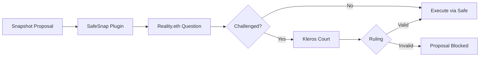

## Overview

The **Zodiac Reality Module** connects off-chain Snapshot voting with on-chain execution through a Gnosis Safe. It uses Reality.eth as the verification layer and Kleros Court as the backstop arbitrator. This pattern is used in production by DAOs including Gnosis and Kleros itself.

---

## Architecture



### Flow

1. A DAO member creates a Snapshot proposal with a batch of on-chain transactions attached via the SafeSnap plugin
2. When the vote passes, SafeSnap posts a question to Reality.eth: "Did this proposal pass and does it meet the DAO requirements?"
3. An answerer posts a bond affirming the result. If unchallenged within the timeout, the transactions execute through the Gnosis Safe
4. If the answer is disputed, the bond escalation mechanism activates. At any point, either party can escalate to Kleros Court for a binding ruling

---

## Setup Steps

<Steps>
  <Step title="Deploy Zodiac Reality Module">
    Deploy the Reality Module through the [Zodiac app](https://zodiac.wiki/) and connect it to your Gnosis Safe. Configure it with:

    - The Reality.eth contract address for your chain
    - A Kleros arbitrator proxy as the arbitrator
    - Minimum bond and timeout parameters
  </Step>
  <Step title="Install SafeSnap Plugin">
    Add the SafeSnap plugin to your Snapshot space. This adds a transaction builder to proposals, allowing proposers to attach on-chain transactions.
  </Step>
  <Step title="Set DAO Requirements">
    Upload a DAO requirements document to IPFS and register it as an ENS text record under the key `daorequirements` on your Snapshot space's ENS name.

    This document defines the criteria for valid proposals. Kleros jurors evaluate proposals against this document when arbitrating disputes.

    ```
    // ENS record example:
    // gnosis.eth → daorequirements → /ipfs/QmYourPolicyDoc...
    ```
  </Step>
  <Step title="Monitor Proposals">
    Use OpenZeppelin Sentinel or a custom bot to monitor Reality.eth questions created by the module. Any address can submit proposals to the Reality Module, so monitoring is critical for detecting malicious submissions.
  </Step>
</Steps>

---

## Reality.eth Question Format

The Reality Module creates questions in this format:

```
"Did the Snapshot proposal with the linked transactions pass
and does it meet the requirements of the document referenced
in the dao requirements record at <dao>.eth?"
```

Jurors evaluate:
- Whether the Snapshot vote actually passed per the space's voting rules
- Whether the proposed transactions match what was described in the proposal
- Whether the proposal complies with the DAO requirements document

---

## Arbitration

When a Reality.eth answer is disputed, anyone can request arbitration by paying the Kleros arbitration fee. The Kleros Arbitrator Proxy:

1. Creates a dispute in Kleros Court (typically the Blockchain or Technical subcourt)
2. Displays the proposal details, transaction data, and DAO requirements document to jurors
3. Returns the ruling to Reality.eth, which finalizes the answer

### Evidence

Evidence is submitted through the Kleros Arbitrator Proxy. Typical evidence includes:
- Screenshots of the Snapshot vote results
- Links to the proposal discussion
- Transaction simulation results
- References to the DAO requirements document

---

## Configuration Reference

| Parameter | Description | Recommended |
| --- | --- | --- |
| **Minimum Bond** | Initial bond required to answer a question | 0.1 ETH or equivalent |
| **Timeout** | Time before an unchallenged answer finalizes | 24–72 hours |
| **Cooldown** | Delay between answer finalization and execution | 24 hours |
| **Expiration** | Time after which the question can no longer be answered | 7 days |
| **Arbitrator** | Kleros arbitrator proxy address | Chain-specific |

---

## Security Considerations

**Malicious proposals** — Anyone can submit proposals to the Reality Module. The bond requirement and Kleros arbitration backstop mitigate this, but active monitoring is essential.

**Missing DAO requirements** — If the `daorequirements` ENS record is not set, questions may be resolved ambiguously. Set this record before activating the module.

**Bond exhaustion** — A well-funded attacker can force multiple bond escalation rounds. The Kleros arbitration option provides a fixed-cost resolution path when bonds become prohibitively expensive.

---

## Resources

<CardGroup cols={2}>
  <Card title="Zodiac Documentation" icon="book" href="https://zodiac.wiki/">
    Full Zodiac module documentation
  </Card>
  <Card title="SafeSnap Guide" icon="camera" href="https://docs.snapshot.org/user-guides/plugins/safesnap">
    Snapshot SafeSnap plugin setup
  </Card>
  <Card title="Reality.eth Integration" icon="link" href="/developers/products/reality/overview">
    Kleros + Reality.eth documentation
  </Card>
  <Card title="Kleros Reality Module Guide" icon="shield" href="https://docs.kleros.io/integrations/types-of-integrations/1.-dispute-resolution-integration-plan/channel-partners/kleros-reality-module">
    Detailed module setup instructions
  </Card>
</CardGroup>