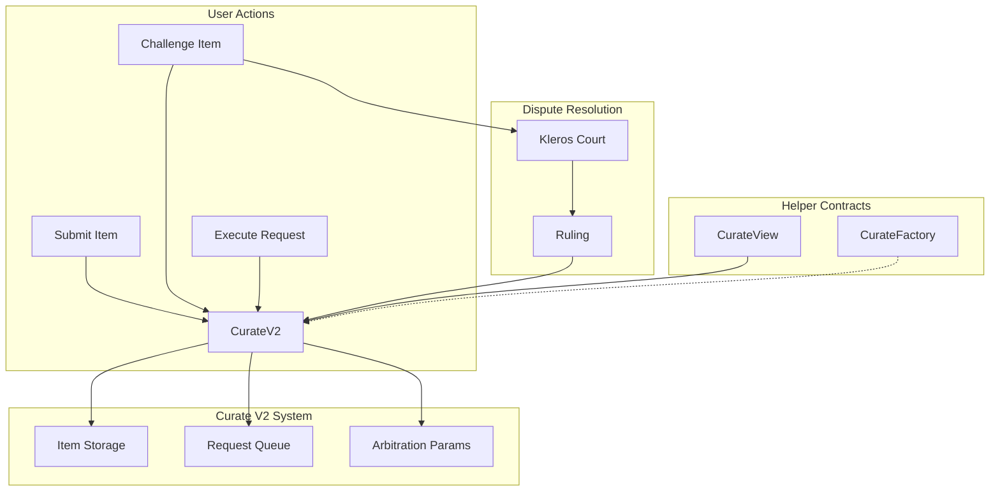
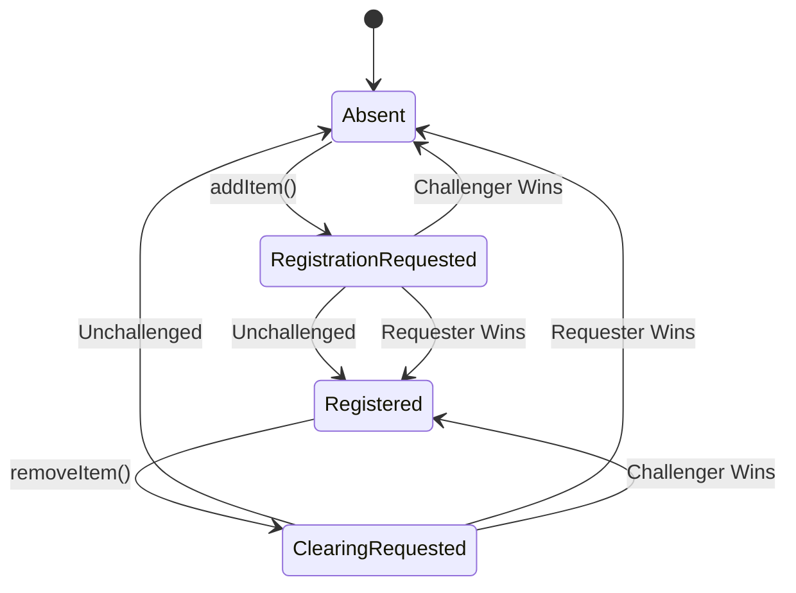

## Introduction

Curate V2 is a decentralized system for creating community-curated lists on the blockchain. Anyone can submit items, challenge entries, and participate through economic incentives. When disputes arise, they're resolved through Kleros Court.

<CardGroup cols={2}>
  <Card title="Smart Contracts" icon="file-contract" href="/products/curate/smart-contracts">
    Core contract interfaces and data structures
  </Card>
  <Card title="Integration Guide" icon="code" href="/products/curate/integration">
    Frontend implementation and event monitoring
  </Card>
</CardGroup>

---

## Deployment

<Tabs>
  <Tab title="Arbitrum One (Production)">
    | Component | Purpose |
    |-----------|---------|
    | CurateV2 | Implementation contract |
    | CurateFactory | Deploys new registries via ERC-1167 proxies |
    | CurateView | Batch query helper |
  </Tab>
  <Tab title="Arbitrum Sepolia (Testnet)">
    | Component | Purpose |
    |-----------|---------|
    | CurateV2 | Implementation contract |
    | CurateFactory | Deploys new registries via ERC-1167 proxies |
    | CurateView | Batch query helper |
  </Tab>
</Tabs>

<Note>
Deploy your own registry through the CurateFactory contract. Each registry is an independent ERC-1167 minimal proxy.
</Note>

---

## Key Improvements from V1

| Feature | V1 | V2 |
|---------|-----|-----|
| **Deployment** | Full contract per registry | ERC-1167 minimal proxy pattern |
| **Governance** | Single governor role | Separate governor and relayer roles |
| **Arbitration** | Parameters can change during dispute | Versioned arbitration parameters preserved |
| **Queries** | Individual calls | Enhanced batch queries via View contract |

---

## System Architecture



---

## Item Lifecycle

Items in Curate V2 follow a state machine with four possible states:



### Status Definitions

| Status | Description |
|--------|-------------|
| **Absent** | Item does not exist in the registry |
| **RegistrationRequested** | Item submission pending, can be challenged |
| **Registered** | Item is active in the registry |
| **ClearingRequested** | Removal pending, can be challenged |

---

## Challenge Mechanism

<Steps>
  <Step title="Request Submitted">
    User submits item (registration) or removal request with required deposit.
  </Step>
  <Step title="Challenge Period">
    Anyone can challenge during the challenge period by paying the challenge deposit.
  </Step>
  <Step title="Dispute Created">
    If challenged, a dispute is created in Kleros Court.
  </Step>
  <Step title="Resolution">
    Winner receives both deposits. Loser forfeits their deposit.
  </Step>
</Steps>

---

## Economic Model

### Deposits Required

| Action | Deposit Type |
|--------|--------------|
| Submit item | Submission deposit + Arbitration cost |
| Remove item | Removal deposit + Arbitration cost |
| Challenge submission | Submission challenge deposit + Arbitration cost |
| Challenge removal | Removal challenge deposit + Arbitration cost |

### Example Flow

```
User submits item:
  Pays: submissionDeposit + arbitrationCost

Someone challenges:
  Pays: challengeDeposit + arbitrationCost

Contract holds: submissionDeposit + challengeDeposit
Arbitrator gets: 2 × arbitrationCost

Winner receives: all held deposits
```

---

## Role Permissions

<AccordionGroup>
  <Accordion title="Governor">
    - Change arbitrator and arbitration parameters
    - Update base deposits
    - Modify challenge period duration
    - Set connected lists
    - Update list metadata
    - Add/remove items directly (bypass challenge period)
  </Accordion>
  
  <Accordion title="Relayer">
    - Add items directly (bypass challenge period)
    - Remove items directly (bypass challenge period)
    - Useful for automated integrations
  </Accordion>
  
  <Accordion title="Public">
    - Submit item requests
    - Submit removal requests
    - Challenge requests
    - Execute unchallenged requests
    - Submit evidence
  </Accordion>
</AccordionGroup>

---

## Arbitration Parameter Versioning

<Info>
**Key Insight:** `arbitrationParamsIndex` ensures disputes use the arbitration settings that were active when the request was created, even if governance later changes them.
</Info>

```solidity
struct ArbitrationParams {
    IArbitratorV2 arbitrator;
    bytes arbitratorExtraData;
    EvidenceModule evidenceModule;
}
```

This prevents governance from affecting ongoing disputes by changing arbitrator settings mid-dispute.

---

## Use Cases

<CardGroup cols={2}>
  <Card title="Token Lists" icon="coins">
    Community-curated lists of legitimate tokens, filtering out scams
  </Card>
  <Card title="NFT Collections" icon="image">
    Verified collections and authenticity registries
  </Card>
  <Card title="Address Tags" icon="tag">
    Label addresses with warnings, categories, or metadata
  </Card>
  <Card title="Content Moderation" icon="shield">
    Decentralized content curation and filtering
  </Card>
</CardGroup>

---

## Resources

<CardGroup cols={2}>
  <Card title="GitHub Repository" icon="github" href="https://github.com/kleros/curate-v2">
    Smart contracts and deployment scripts
  </Card>
  <Card title="Live Application" icon="rocket" href="https://curate-v2.netlify.app">
    Production Curate interface
  </Card>
  <Card title="Kleros Documentation" icon="book" href="https://docs.kleros.io">
    General Kleros documentation
  </Card>
  <Card title="Discord Community" icon="discord" href="https://discord.gg/kleros">
    Get help from the community
  </Card>
</CardGroup>