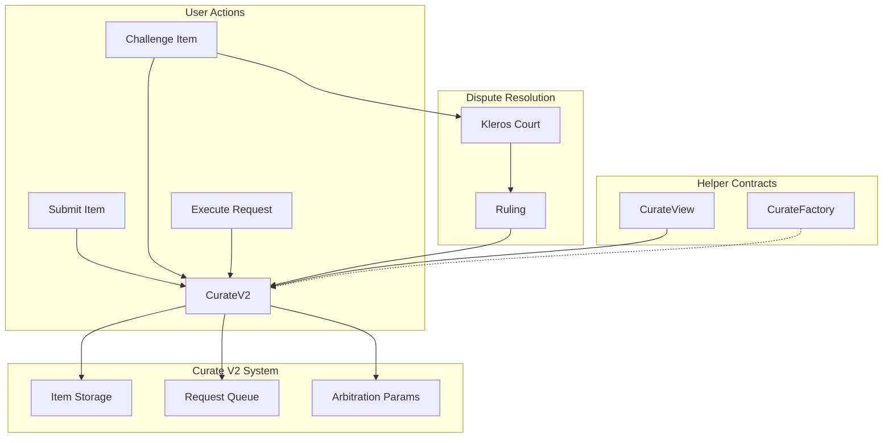
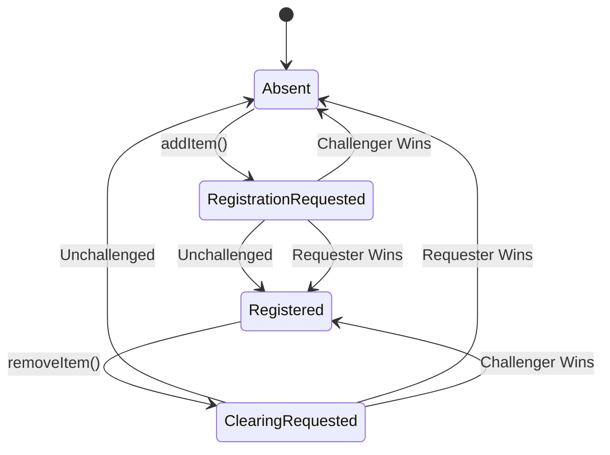

## Introduction

Curate is a decentralized system for creating community-curated lists on the blockchain. Anyone can submit items, challenge entries, and participate through economic incentives. When disputes arise, they're resolved through Kleros Court. This page covers both V1 (Classic and Light Curate on Ethereum / Gnosis Chain) and V2 (Arbitrum).

<CardGroup cols={2}>
  <Card title="Smart Contracts" icon="file-contract" href="/developers/products/curate/smart-contracts">
    Core contract interfaces and data structures
  </Card>
  <Card title="Curate Classic (V1)" icon="list" href="/developers/products/curate/curate-classic">
    V1 integration guide - full TCR
  </Card>
  <Card title="Light Curate (V1)" icon="list-check" href="/developers/products/curate/light-curate">
    V1 integration guide - simplified TCR
  </Card>
  <Card title="Registries" icon="database" href="/developers/products/curate/registries">
    Registry reference
  </Card>
</CardGroup>

---

## V1 - Curate Classic and Light Curate (Ethereum / Gnosis Chain)

Curate Classic is the full Token-Curated Registry, and Light Curate is the simplified, higher-volume variant. Both are on Ethereum and Gnosis Chain and are eligible for direct integration by third-party developers.

**Full V1 integration guides are available:** see the [Curate Classic](/developers/products/curate/curate-classic) and [Light Curate](/developers/products/curate/light-curate) subpages. For V1 contract addresses, see [Deployment Addresses](/reference/contracts/deployment-addresses-v1).

---

## V2 - Curate V2 (Arbitrum)

The sections below document Curate V2 technical details.

Technical notes for integrators:

- **Evidence handling**: Curate V2 does not use a separate Evidence Module; evidence submission is handled directly by the `CurateV2` and `CurateFactory` contracts
- **Subgraph**: the schema includes dedicated fields for requester and challenger evidence
- **Frontend stack**: the interface uses Tailwind CSS and the shared components library, including the shared file viewer
- **Developer documentation**: basic developer documentation is available in the [Curate V2 GitHub repository](https://github.com/kleros/curate-v2)

---

## Deployment

<Tabs>
  <Tab title="Arbitrum One (Production)">
    | Component | Purpose |
    |-----------|---------|
    | CurateV2 | Implementation contract |
    | CurateFactory | Deploys new registries via ERC-1167 proxies |
    | CurateView | Batch query helper |
  </Tab>
  <Tab title="Arbitrum Sepolia (Testnet)">
    | Component | Purpose |
    |-----------|---------|
    | CurateV2 | Implementation contract |
    | CurateFactory | Deploys new registries via ERC-1167 proxies |
    | CurateView | Batch query helper |
  </Tab>
</Tabs>

<Note>
Deploy your own registry through the CurateFactory contract. Each registry is an independent ERC-1167 minimal proxy.
</Note>

---

## Key Improvements from V1

| Feature | V1 | V2 |
|---------|-----|-----|
| **Deployment** | Full contract per registry | ERC-1167 minimal proxy pattern |
| **Governance** | Single governor role | Separate governor and relayer roles |
| **Arbitration** | Parameters can change during dispute | Versioned arbitration parameters preserved |
| **Queries** | Individual calls | Enhanced batch queries via View contract |

---

## System Architecture


```mermaid
graph TB
    subgraph "User Actions"
        A[Submit Item] --> B[CurateV2]
        C[Challenge Item] --> B
        D[Execute Request] --> B
    end
    
    subgraph "Curate V2 System"
        B --> E[Item Storage]
        B --> F[Request Queue]
        B --> G[Arbitration Params]
    end
    
    subgraph "Dispute Resolution"
        C --> H[Kleros Court]
        H --> I[Ruling]
        I --> B
    end
    
    subgraph "Helper Contracts"
        J[CurateView] --> B
        K[CurateFactory] -.-> B
    end
```

---

## Item Lifecycle

Items in Curate V2 follow a state machine with four possible states:


```mermaid
stateDiagram-v2
    [*] --> Absent
    Absent --> RegistrationRequested: addItem()
    RegistrationRequested --> Registered: Unchallenged
    RegistrationRequested --> Registered: Requester Wins
    RegistrationRequested --> Absent: Challenger Wins
    Registered --> ClearingRequested: removeItem()
    ClearingRequested --> Absent: Unchallenged
    ClearingRequested --> Absent: Requester Wins
    ClearingRequested --> Registered: Challenger Wins
```

### Status Definitions

| Status | Description |
|--------|-------------|
| **Absent** | Item does not exist in the registry |
| **RegistrationRequested** | Item submission pending, can be challenged |
| **Registered** | Item is active in the registry |
| **ClearingRequested** | Removal pending, can be challenged |

---

## Challenge Mechanism

<Steps>
  <Step title="Request Submitted">
    User submits item (registration) or removal request with required deposit.
  </Step>
  <Step title="Challenge Period">
    Anyone can challenge during the challenge period by paying the challenge deposit.
  </Step>
  <Step title="Dispute Created">
    If challenged, a dispute is created in Kleros Court.
  </Step>
  <Step title="Resolution">
    Winner receives both deposits. Loser forfeits their deposit.
  </Step>
</Steps>

---

## Economic Model

### Deposits Required

| Action | Deposit Type |
|--------|--------------|
| Submit item | Submission deposit + Arbitration cost |
| Remove item | Removal deposit + Arbitration cost |
| Challenge submission | Submission challenge deposit + Arbitration cost |
| Challenge removal | Removal challenge deposit + Arbitration cost |

### Example Flow

```
User submits item:
  Pays: submissionDeposit + arbitrationCost

Someone challenges:
  Pays: challengeDeposit + arbitrationCost

Contract holds: submissionDeposit + challengeDeposit
Arbitrator gets: 2 × arbitrationCost

Winner receives: all held deposits
```

---

## Role Permissions

<AccordionGroup>
  <Accordion title="Governor">
    - Change arbitrator and arbitration parameters
    - Update base deposits
    - Modify challenge period duration
    - Set connected lists
    - Update list metadata
    - Add/remove items directly (bypass challenge period)
  </Accordion>
  
  <Accordion title="Relayer">
    - Add items directly (bypass challenge period)
    - Remove items directly (bypass challenge period)
    - Useful for automated integrations
  </Accordion>
  
  <Accordion title="Public">
    - Submit item requests
    - Submit removal requests
    - Challenge requests
    - Execute unchallenged requests
    - Submit evidence
  </Accordion>
</AccordionGroup>

---

## Arbitration Parameter Versioning

<Info>
**Key Insight:** `arbitrationParamsIndex` ensures disputes use the arbitration settings that were active when the request was created, even if governance later changes them.
</Info>

```solidity
struct ArbitrationParams {
    IArbitratorV2 arbitrator;
    bytes arbitratorExtraData;
    EvidenceModule evidenceModule;
}
```

This prevents governance from affecting ongoing disputes by changing arbitrator settings mid-dispute.

---

## Use Cases

<CardGroup cols={2}>
  <Card title="Token Lists" icon="coins">
    Community-curated lists of legitimate tokens, filtering out scams
  </Card>
  <Card title="NFT Collections" icon="image">
    Verified collections and authenticity registries
  </Card>
  <Card title="Address Tags" icon="tag">
    Label addresses with warnings, categories, or metadata
  </Card>
  <Card title="Content Moderation" icon="shield">
    Decentralized content curation and filtering
  </Card>
</CardGroup>

---

## Stake Curate

Stake Curate is part of the Curate product family. It uses V1 Kleros Court on Gnosis Chain for dispute resolution. Unlike traditional Curate, where deposits are returned after listing, Stake Curate keeps deposits locked - anyone can challenge at any time, and challengers earn bounties. It launched in January 2026, with its first use case being Battle-Tested DeFi Vaults.

---

## Scout

Scout is the primary frontend for the Curate-based address tag registries. It reached its definitive version in May 2026 with over 2.6 million curated on-chain addresses. For technical details, chain support, partners, and the GTCR Indexer, see the [Scout page](/developers/products/scout/overview).

The GTCR Indexer schema was extended with challenge transaction hashes, challenge dates, and appeal transaction hashes (v0.1.7, April 2026), with an Envio branch maintained alongside the main branch.

---

## Resources

<CardGroup cols={2}>
  <Card title="GitHub Repository" icon="github" href="https://github.com/kleros/curate-v2">
    Smart contracts and deployment scripts
  </Card>
  <Card title="Live Application" icon="rocket" href="https://curate-v2.netlify.app">
    Production Curate interface
  </Card>
  <Card title="Discord Community" icon="discord" href="https://discord.gg/kleros">
    Get help from the community
  </Card>
</CardGroup>