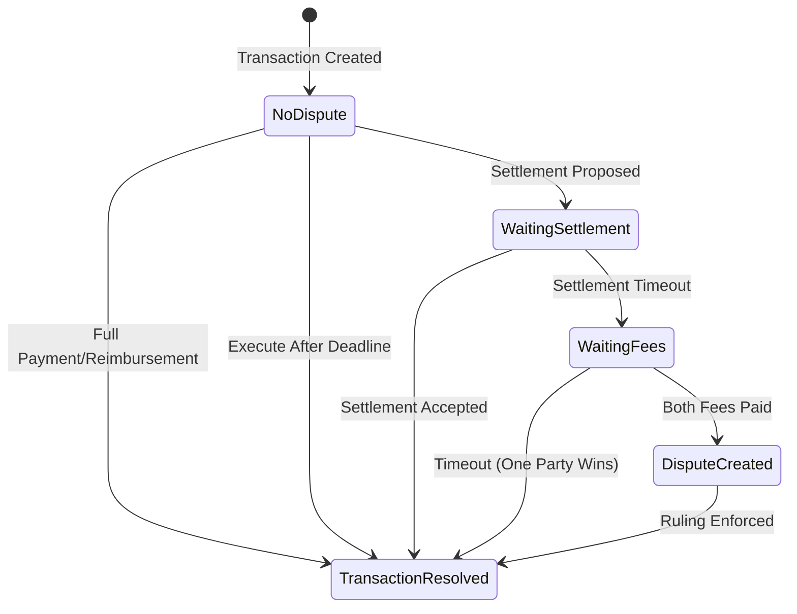

## Introduction

Kleros Escrow V2 enables secure peer-to-peer transactions with built-in dispute resolution through Kleros Court. The system supports both native ETH and ERC20 tokens, with features including settlement negotiations, partial payments, and deadline-based automatic execution.

<CardGroup cols={2}>
  <Card title="Smart Contracts" icon="file-contract" href="/products/escrow/smart-contracts">
    Core contract interfaces and data structures
  </Card>
  <Card title="Integration Guide" icon="code" href="/products/escrow/integration">
    React hooks and frontend implementation
  </Card>
</CardGroup>

---

## Contract Addresses

<Tabs>
  <Tab title="Arbitrum One (Production)">
    | Contract | Address |
    |----------|---------|
    | EscrowUniversal | `0x79530E7Bb3950A3a4b5a167816154715681F2f6c` |
    | EscrowView | `0x3Fed94ee4FA1B5665DB84489f913E2c7e1290459` |
  </Tab>
  <Tab title="Arbitrum Sepolia (Testnet)">
    | Contract | Address |
    |----------|---------|
    | EscrowUniversal | `0x5ef185810BCe41c03c9E5ca271B8C91F1024F953` |
    | EscrowView | `0x6451046caB9291a919FCba045bf6Bb8E0Bb71467` |
  </Tab>
</Tabs>

---

## Architecture

Escrow V2 consists of three main components:

<Steps>
  <Step title="Smart Contracts">
    Core escrow logic supporting ETH and ERC20 tokens with settlement negotiations and dispute integration.
  </Step>
  <Step title="Web Application">
    React-based frontend for creating and managing transactions at [escrow.kleros.io](https://escrow.kleros.io).
  </Step>
  <Step title="Dispute Resolution">
    Integration with Kleros Court for decentralized arbitration when parties cannot agree.
  </Step>
</Steps>

### Contract Components

| Contract | Purpose |
|----------|---------|
| **EscrowUniversal.sol** | Main contract handling transaction creation, payments, settlements, and dispute arbitration |
| **EscrowView.sol** | View-only contract providing formatted ruling options and payout calculations |

---

## Transaction Lifecycle

---

## Key Features

<AccordionGroup>
  <Accordion title="Native ETH & ERC20 Support">
    Create escrow transactions with any ERC20 token or native ETH. Per-token amount caps can be set by governance to manage risk.
  </Accordion>
  
  <Accordion title="Partial Payments & Reimbursements">
    Buyers can release partial payments and sellers can issue partial refunds, enabling flexible resolution without disputes.
  </Accordion>
  
  <Accordion title="Settlement Negotiations">
    Either party can propose settlements. The alternating proposal system prevents unfair rushing to arbitration.
  </Accordion>
  
  <Accordion title="Deadline-Based Execution">
    Transactions can be automatically executed after their deadline, releasing funds to the seller.
  </Accordion>
  
  <Accordion title="Kleros Court Integration">
    Full dispute resolution through Kleros Court with appeal support and evidence submission.
  </Accordion>
</AccordionGroup>

---

## Resources

<CardGroup cols={2}>
  <Card title="GitHub Repository" icon="github" href="https://github.com/kleros/escrow-v2">
    Smart contracts and web application source code
  </Card>
  <Card title="Live Application" icon="rocket" href="https://escrow.kleros.io">
    Production Escrow interface
  </Card>
  <Card title="Kleros Documentation" icon="book" href="https://docs.kleros.io">
    General Kleros documentation
  </Card>
  <Card title="Discord Community" icon="discord" href="https://discord.gg/kleros">
    Get help from the community
  </Card>
</CardGroup>