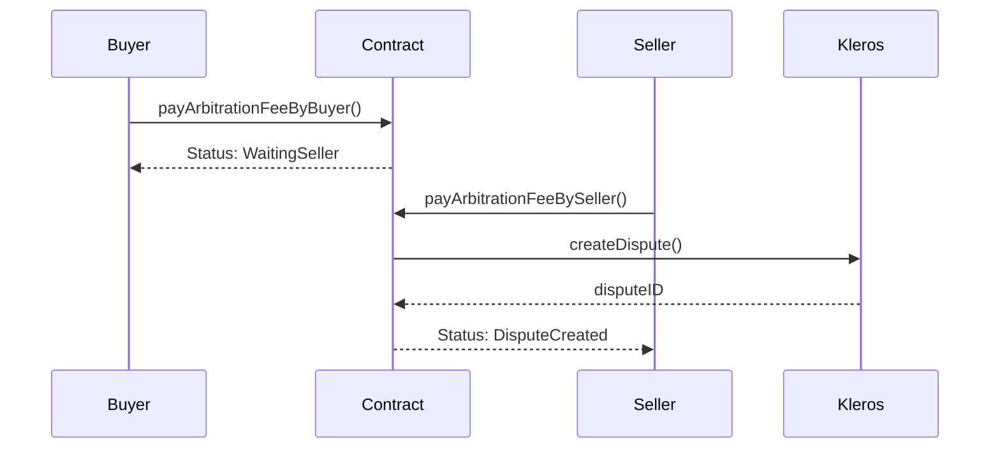

## Core Data Structures

### Transaction Struct

```solidity
struct Transaction {
    address payable buyer;          // Payment sender
    address payable seller;         // Payment recipient
    uint256 amount;                 // Remaining escrow amount
    uint256 settlementBuyer;        // Buyer's proposed settlement amount
    uint256 settlementSeller;       // Seller's proposed settlement amount
    uint256 deadline;               // Initial delivery deadline
    uint256 disputeID;              // Kleros dispute identifier
    uint256 buyerFee;               // Arbitration fees paid by buyer
    uint256 sellerFee;              // Arbitration fees paid by seller
    uint256 lastFeePaymentTime;     // Last interaction timestamp
    Status status;                  // Current transaction state
    IERC20 token;                   // Token contract (address(0) for ETH)
}
```

### Status Enumeration

```solidity
enum Status {
    NoDispute,               // Initial state
    WaitingSettlementBuyer,  // Waiting for buyer settlement response
    WaitingSettlementSeller, // Waiting for seller settlement response
    WaitingBuyer,            // Waiting for buyer arbitration fee
    WaitingSeller,           // Waiting for seller arbitration fee
    DisputeCreated,          // Active Kleros dispute
    TransactionResolved      // Final state
}
```

### Party & Resolution Enumerations

```solidity
enum Party {
    None,   // No winner (split decision)
    Buyer,  // Buyer wins dispute
    Seller  // Seller wins dispute
}

enum Resolution {
    TransactionExecuted,  // Normal completion
    TimeoutByBuyer,       // Seller didn't pay arbitration fees
    TimeoutBySeller,      // Buyer didn't pay arbitration fees
    RulingEnforced,       // Dispute resolved by jurors
    SettlementReached     // Settlement accepted by parties
}
```

---

## Creating Transactions

### Native ETH Transaction

```solidity
function createNativeTransaction(
    uint256 _deadline,              // Unix timestamp for automatic execution
    string memory _transactionUri,  // Data URI for transaction metadata
    address payable _seller         // Payment recipient address
) external payable returns (uint256 transactionID)
```

### ERC20 Token Transaction

```solidity
function createERC20Transaction(
    uint256 _amount,                // Token amount (in token's base units)
    IERC20 _token,                  // ERC20 token contract address
    uint256 _deadline,              // Unix timestamp for automatic execution
    string memory _transactionUri,  // Data URI for transaction metadata
    address payable _seller         // Payment recipient address
) external returns (uint256 transactionID)
```

<Warning>
Both functions enforce per-token amount caps via the `shouldNotExceedCap` modifier. Transactions exceeding the cap will revert with `AmountExceedsCap()` error.
</Warning>

---

## Managing Transactions

### Payment Functions

```solidity
// Buyer releases payment to seller
function pay(uint256 _transactionID, uint256 _amount) external

// Seller reimburses buyer
function reimburse(uint256 _transactionID, uint256 _amountReimbursed) external

// Execute transaction after deadline
function executeTransaction(uint256 _transactionID) external
```

<Info>
**Key Behaviors:**
- `pay()` and `reimburse()` can be called multiple times with partial amounts
- When the entire amount is paid/reimbursed, status changes to `TransactionResolved`
- `executeTransaction()` transfers all remaining funds to the seller after deadline
- All three functions require status to be `NoDispute` or will revert with `TransactionDisputed()`
</Info>

---

## Settlement System

### Settlement Functions

```solidity
// Propose settlement amount (seller receives this amount, buyer gets remainder)
function proposeSettlement(uint256 _transactionID, uint256 _amount) external

// Accept the other party's proposed settlement
function acceptSettlement(uint256 _transactionID) external
```

### Settlement Flow

<Steps>
  <Step title="Initiate Proposal">
    Either party proposes a settlement amount using `proposeSettlement()`.
  </Step>
  <Step title="Status Change">
    Status changes to `WaitingSettlementBuyer` or `WaitingSettlementSeller`.
  </Step>
  <Step title="Response">
    The other party can either accept the settlement or propose a counter-offer.
  </Step>
  <Step title="Counter-Offers">
    Counter-offers reset `lastFeePaymentTime` and switch the waiting status.
  </Step>
  <Step title="Dispute Option">
    Only the non-proposing party can raise a dispute (after `settlementTimeout` elapses).
  </Step>
</Steps>

<Note>
**Settlement Acceptance:** Upon acceptance, funds are immediately distributed. Seller receives the proposed settlement amount, buyer receives the remainder. For ERC20 tokens, SafeERC20 library ensures both transfers succeed atomically.
</Note>

---

## Dispute Management

### Arbitration Fee Functions

```solidity
// Pay arbitration fee as buyer
function payArbitrationFeeByBuyer(uint256 _transactionID) external payable

// Pay arbitration fee as seller
function payArbitrationFeeBySeller(uint256 _transactionID) external payable

// Claim win if seller doesn't pay fee
function timeOutByBuyer(uint256 _transactionID) external

// Claim win if buyer doesn't pay fee
function timeOutBySeller(uint256 _transactionID) external
```

### Dispute Creation Process



### Fee Calculation

```solidity
uint256 arbitrationCost = arbitrator.arbitrationCost(arbitratorExtraData);
```

<Warning>
**Timeout Rules:**
- Settlement proposers must wait `settlementTimeout` before paying fees
- If one party fails to pay within `feeTimeout`, the other party wins by default
- The winning party receives all escrowed funds plus their fee refunded
</Warning>

---

## Query Functions

### Transaction Queries

```solidity
// Get count of all transactions
function getTransactionCount() external view returns (uint256)

// Get detailed transaction information
function transactions(uint256 _index) external view returns (
    address payable buyer,
    address payable seller,
    uint256 amount,
    uint256 settlementBuyer,
    uint256 settlementSeller,
    uint256 deadline,
    uint256 disputeID,
    uint256 buyerFee,
    uint256 sellerFee,
    uint256 lastFeePaymentTime,
    Status status,
    IERC20 token
)
```

### Payout Calculation

```solidity
// Get payout distribution for different outcomes
function getPayouts(
    uint256 _transactionID,
    Party _winningParty
) public view returns (
    uint256 buyerPayout,
    uint256 buyerPayoutToken,
    uint256 sellerPayout,
    uint256 sellerPayoutToken
)
```

**Payout Logic:**

| Winner | Buyer Receives | Seller Receives |
|--------|----------------|-----------------|
| **Buyer** | Fee refund + amount - seller's settlement (if any) | Seller's settlement proposal |
| **Seller** | Remainder after seller's settlement | Fee refund + settlement (or full amount) |
| **None** | Split fees + split amount | Split fees + split amount |

### Other Queries

```solidity
// Check per-token amount cap (0 means unlimited)
function amountCaps(IERC20 _token) external view returns (uint256)

// Get current arbitrator contract
function arbitrator() external view returns (IArbitratorV2)

// Get current governor address
function governor() external view returns (address)

// Get arbitration fee timeout
function feeTimeout() external view returns (uint256)

// Get settlement response timeout
function settlementTimeout() external view returns (uint256)

// Get dispute ID to transaction ID mapping
function disputeIDtoTransactionID(uint256 _disputeID) external view returns (uint256)
```

---

## Governor Functions

<Note>
All governor functions are restricted to the current governor address.
</Note>

```solidity
// Change contract governor
function changeGovernor(address _governor) external onlyByGovernor

// Update arbitrator contract address
function changeArbitrator(IArbitratorV2 _arbitrator) external onlyByGovernor

// Modify arbitrator extra data (court ID, juror count)
function changeArbitratorExtraData(bytes calldata _arbitratorExtraData) external onlyByGovernor

// Update arbitration fee payment timeout
function changeFeeTimeout(uint256 _feeTimeout) external onlyByGovernor

// Update settlement response timeout
function changeSettlementTimeout(uint256 _settlementTimeout) external onlyByGovernor

// Set per-token amount cap (0 for unlimited, address(0) for native ETH)
function changeAmountCap(IERC20 _token, uint256 _amountCap) external onlyByGovernor

// Update dispute template and data mappings
function changeDisputeTemplate(
    string memory _templateData,
    string memory _templateDataMappings
) external onlyByGovernor

// Update template registry contract
function changeTemplateRegistry(IDisputeTemplateRegistry _templateRegistry) external onlyByGovernor
```

---

## Events

### Transaction Events

```solidity
event NativeTransactionCreated(
    uint256 indexed _transactionID,
    string _transactionUri,
    address indexed _buyer,
    address indexed _seller,
    uint256 _amount,
    uint256 _deadline
)

event ERC20TransactionCreated(
    uint256 indexed _transactionID,
    string _transactionUri,
    address indexed _buyer,
    address indexed _seller,
    IERC20 _token,
    uint256 _amount,
    uint256 _deadline
)
```

### Management Events

```solidity
// Payment event
event Payment(uint256 indexed _transactionID, uint256 _amount, address _party)

// Fee payment notification
event HasToPayFee(uint256 indexed _transactionID, Party _party)

// Settlement proposal
event SettlementProposed(uint256 indexed _transactionID, Party _party, uint256 _amount)

// Transaction resolution
event TransactionResolved(uint256 indexed _transactionID, Resolution indexed _resolution)

// Dispute creation
event DisputeRequest(
    IArbitratorV2 indexed _arbitrator, 
    uint256 _disputeID, 
    uint256 indexed _externalDisputeID, 
    uint256 _templateId, 
    string _template
)
```

---

## Transaction Metadata Format

Transactions store metadata onchain using data URIs. The metadata JSON structure:

```json
{
  "title": "Transaction Title",
  "description": "Detailed description of the deliverables and terms",
  "extraDescriptionUri": "ipfs://QmAttachmentDocumentHash"
}
```

For crypto-to-crypto transactions:

```json
{
  "title": "Cross-chain Token Swap",
  "description": "ETH to SOL exchange",
  "otherChain": "Solana",
  "otherChainAddress": "SolanaWalletAddress", 
  "otherAsset": "SOL",
  "otherAmount": "5"
}
```

### Creating Data URIs

```javascript
const metadata = {
  title: "Website Development Project",
  description: "Build responsive website with React",
  extraDescriptionUri: "ipfs://QmDocumentHash"
};

const dataUri = `data:application/json;base64,${btoa(JSON.stringify(metadata))}`;

// Use this dataUri when creating the transaction
await createNativeTransaction(deadline, dataUri, sellerAddress);
```

<Tip>
**Metadata Guidelines:**
- Metadata is stored directly onchain via data URIs, eliminating IPFS dependencies
- Keep core metadata concise as base64 encoding increases transaction size
- Use `extraDescriptionUri` for large attachments or evidence documents
</Tip>