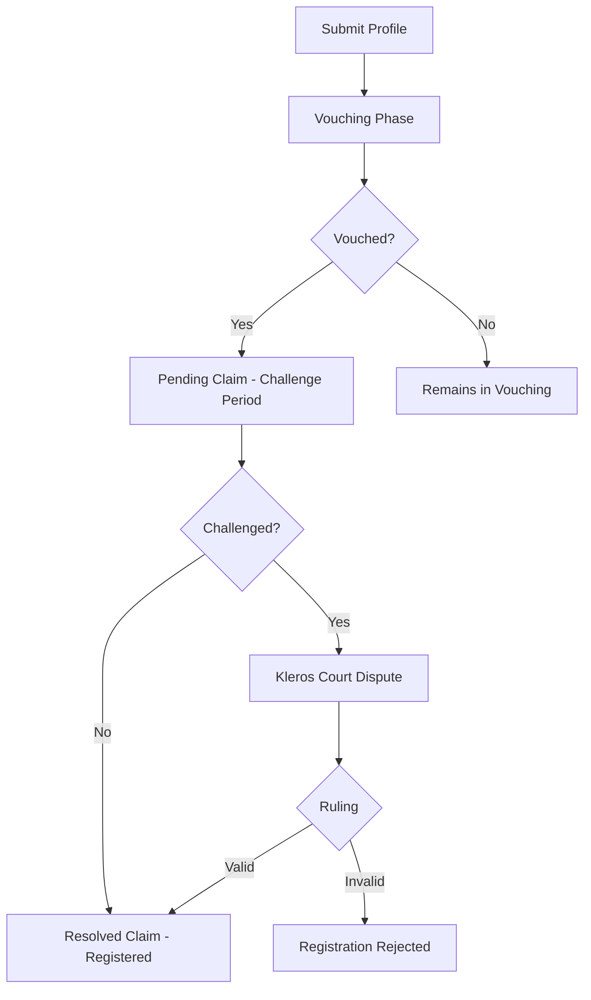

## Introduction

Proof of Humanity (PoH) V2 is a Sybil-resistant registry of unique human identities. Each verified human receives a soulbound humanity ID (`humanityId`) that persists across wallet changes. PoH V2 uses Kleros Court for dispute resolution when profiles are challenged.

Unlike V1 where each registration was bound to a specific wallet address, V2 decouples identity from address. One human maps to one humanity ID, which maps to one wallet address at any time. If a user loses wallet access, they can remove the lost address and re-register with a new one using the same `humanityId`.

<CardGroup cols={2}>
  <Card title="Smart Contracts" icon="file-contract" href="/developers/products/poh/smart-contracts">
    Core interfaces, data structures, and contract addresses
  </Card>
  <Card title="Integration Guide" icon="code" href="/developers/products/poh/integration">
    Integrate PoH identity verification into your application
  </Card>
</CardGroup>

---

## Contract Addresses

<Tabs>
  <Tab title="Gnosis Chain (Production)">
    | Contract | Address |
    | --- | --- |
    | ProofOfHumanity | `0xA7Fd7A97bF12E112B2263957e115e0c46cE6A38C` |
    | CrossChainProofOfHumanity | Deployed per foreign chain |
  </Tab>
  <Tab title="Ethereum Mainnet (V1 Fork Module)">
    | Contract | Address |
    | --- | --- |
    | ProofOfHumanity (V1) | `0xC5E9dDebb09Cd64DfaCab4011A0D5cEDaf7c9BDb` |
  </Tab>
</Tabs>

<Note>
  PoH V2 operates on Gnosis Chain as the home chain. Cross-chain state is synchronized to other chains through bridge contracts. V1 registrations remain accessible through a Fork Module.
</Note>

---

## Architecture

PoH V2 consists of three layers:

<Steps>
  <Step title="Identity Registry">
    Core contract managing humanity IDs, registration claims, vouching, and challenge periods. Each humanity ID is a `bytes20` value that uniquely identifies a verified human.
  </Step>
  <Step title="Cross-Chain Synchronization">
    Bridge contracts propagate humanity state across chains, enabling `isHuman()` checks on any supported network.
  </Step>
  <Step title="Dispute Resolution">
    Challenged registrations create disputes in Kleros Court. Jurors evaluate video evidence and vouching validity according to the registration policy.
  </Step>
</Steps>

### Identity Model

```
1 human → 1 humanityId (bytes20) → 1 wallet address

// Wallet recovery flow:
humanity.owner == lostAddress      // Lost access
humanity.owner == address(0)       // Removal requested
humanity.owner == newAddress       // Re-registered with new wallet
```

V1 users have a `humanityId` equal to their original registration address (`bytes20(address)`). V2 users receive a new unique `humanityId` at registration.

---

## Registration Lifecycle



---

## Key Features

<AccordionGroup>
  <Accordion title="Soulbound Humanity IDs">
    Humanity IDs persist across wallet changes. Applications that store data by `humanityId` rather than address preserve user reputation and assets even when the underlying wallet changes.
  </Accordion>
  <Accordion title="Cross-Chain Verification">
    The `isHuman()` function is available on multiple chains through `CrossChainProofOfHumanity` contracts. Synchronization uses bridge infrastructure to propagate registration state.
  </Accordion>
  <Accordion title="V1 Backward Compatibility">
    A Fork Module allows V1 registrations to be recognized by V2. The `isHuman()` call automatically checks both V2 native registrations and V1 legacy registrations.
  </Accordion>
  <Accordion title="Vouching System">
    New registrants need a vouch from an existing verified human. The keeper bot processes vouches and reward withdrawals automatically, reducing manual intervention.
  </Accordion>
</AccordionGroup>

---

## Resources

<CardGroup cols={2}>
  <Card title="GitHub Repository" icon="github" href="https://github.com/kleros/proof-of-humanity-v2-contracts">
    Smart contracts source code
  </Card>
  <Card title="Live Application" icon="globe" href="https://proofofhumanity.id">
    Production PoH interface
  </Card>
  <Card title="GitBook Documentation" icon="book" href="https://docs.kleros.io/products/proof-of-humanity">
    End-user documentation
  </Card>
  <Card title="Discord" icon="discord" href="https://discord.gg/kleros">
    Developer support
  </Card>
</CardGroup>