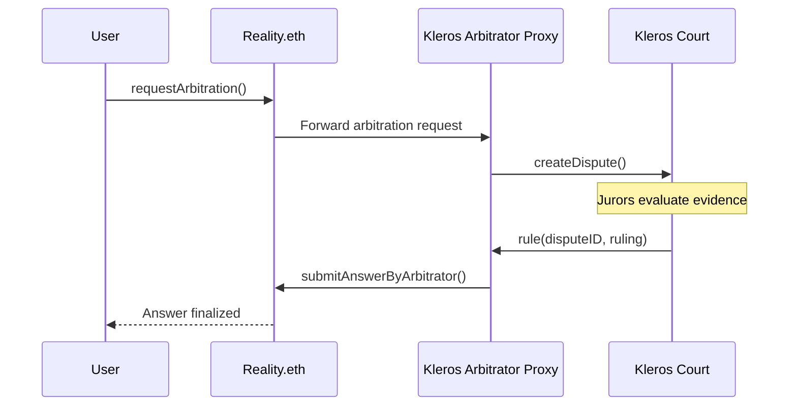

## Kleros Arbitrator Proxy Addresses

The arbitrator proxy sits between Reality.eth and Kleros Court. When asking a question on Reality.eth, you pass the proxy address as the `arbitrator` parameter.

### Ethereum Mainnet

| Proxy | Court | Address |
| --- | --- | --- |
| General Court | General | `0x728cba71a3723caab33ea416cb46e2cc9215a596` |
| Technical Court | Blockchain > Technical | `0xf72cfd1b34a91a64f9a98537fe63fbab7530adca` |

### Gnosis Chain

| Proxy | Court | Address |
| --- | --- | --- |
| General Court | General | Check [deployment addresses](https://docs.kleros.io/developer/deployment-addresses) |

<Note>
  Each proxy is configured with a specific number of initial juror votes and a subcourt. Contact `integrations@kleros.io` to deploy a custom proxy for your use case.
</Note>

---

## Reality.eth Interface

Your contract interacts with Reality.eth through these core functions:

### Asking Questions

```solidity
/// @dev Ask a question on Reality.eth with a Kleros arbitrator.
/// @param templateID The question template (0=bool, 1=uint, 2=single-select, etc.)
/// @param question The question string with parameters separated by ␟ delimiter
/// @param arbitrator The Kleros arbitrator proxy address
/// @param timeout Seconds before an unchallenged answer finalizes
/// @param openingTimestamp When the question becomes answerable (0 for immediately)
/// @param nonce Unique nonce for question deduplication
/// @return questionID The unique identifier for the question
function askQuestion(
    uint256 templateID,
    string calldata question,
    address arbitrator,
    uint32 timeout,
    uint32 openingTimestamp,
    uint256 nonce
) external payable returns (bytes32 questionID);
```

### Reading Answers

```solidity
/// @dev Returns the finalized answer for a question.
/// Reverts if the question has not been finalized.
function resultFor(bytes32 _questionID) external view returns (bytes32);

/// @dev Returns the best current answer and metadata.
function getBestAnswer(bytes32 _questionID) external view returns (bytes32);

/// @dev Returns true if the question has been finalized.
function isFinalized(bytes32 _questionID) external view returns (bool);
```

### Submitting Answers

```solidity
/// @dev Submit an answer, must include a bond >= 2x the current bond.
function submitAnswer(
    bytes32 _questionID,
    bytes32 _answer,
    uint256 _maxPrevious
) external payable;
```

### Requesting Arbitration

```solidity
/// @dev Request arbitration from the specified arbitrator.
/// Requires payment of the arbitration fee.
function notifyOfArbitrationRequest(
    bytes32 _questionID,
    address _requester,
    uint256 _maxPrevious
) external;
```

---

## Question Format

Questions use the Unicode delimiter `␟` (U+241F) to separate fields:

```
// Template 0 (bool):
"Did event X happen?␟category␟en"

// Template 1 (uint):
"What was the price of ETH on April 16, 2025?␟crypto␟en"

// Template 2 (single-select):
"Which team won?␟\"Option A\",\"Option B\",\"Option C\"␟category␟en"
```

The `INVALID` answer (`0xff...ff`) is reserved for questions that cannot be answered or are ambiguous.

---

## Arbitration Flow

When arbitration is requested:

1. The requester pays the arbitration fee to the Kleros Arbitrator Proxy
2. The proxy creates a dispute in Kleros Court with the configured subcourt and juror count
3. Evidence can be submitted through the proxy contract
4. After jurors vote and the ruling is final, the proxy calls `submitAnswerByArbitrator()` on Reality.eth
5. Reality.eth finalizes the answer based on the arbitrator's ruling



---

## Evidence Submission

Evidence for arbitrated questions is submitted through the Kleros Arbitrator Proxy, not through Reality.eth:

```solidity
/// @dev Submit evidence for an ongoing arbitration.
/// @param _questionID The Reality.eth question identifier
/// @param _evidenceURI IPFS URI pointing to the evidence JSON
function submitEvidence(bytes32 _questionID, string calldata _evidenceURI) external;
```

Evidence JSON follows the standard format:

```json
{
  "name": "Price data from CoinGecko",
  "description": "Screenshot showing ETH price on the specified date",
  "fileURI": "/ipfs/QmExample...",
  "fileHash": "0x..."
}
```