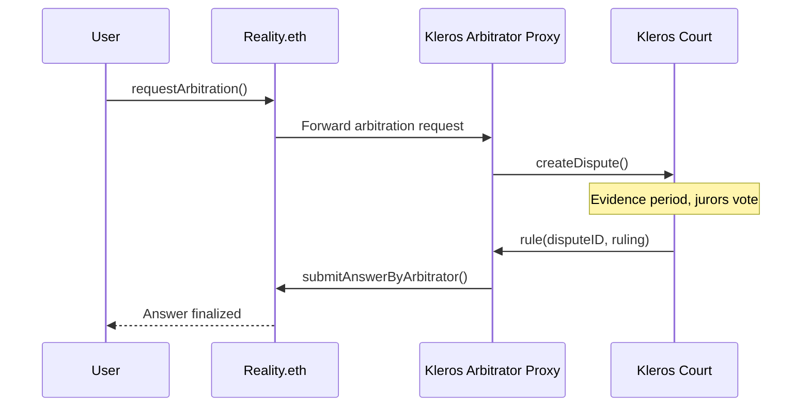

## Kleros Arbitrator Proxy Addresses

The arbitrator proxy sits between Reality.eth and Kleros Court. When asking a question on Reality.eth, you pass the proxy address as the `arbitrator` parameter.

### Ethereum Mainnet

| Proxy           | Court                  | Address                                      |
| --------------- | ---------------------- | -------------------------------------------- |
| General Court   | General                | `0x728cba71a3723caab33ea416cb46e2cc9215a596` |
| Technical Court | Blockchain > Technical | `0xf72cfd1b34a91a64f9a98537fe63fbab7530adca` |

### Sepolia Testnet

| Proxy         | Court   | Address                                      |
| ------------- | ------- | -------------------------------------------- |
| General Court | General | `0x05b942faecfb3924970e3a28e0f230910cedff45` |

### Gnosis Chain

| Proxy         | Court   | Address                                                                             |
| ------------- | ------- | ----------------------------------------------------------------------------------- |
| General Court | General | Check [deployment addresses](https://docs.kleros.io/developer/deployment-addresses) |

### Cross-chain Proxies

For deployments where the question lives on one chain and arbitration runs on another (e.g. question on Polygon, arbitration on Ethereum), see the [cross-chain-realitio-proxy deployments](https://github.com/kleros/cross-chain-realitio-proxy/tree/master/contracts#deployments).

<Note>
  Each proxy is configured with a specific subcourt, initial number of juror votes, and arbitration fee. Contact `integrations@kleros.io` to deploy a custom proxy for your use case.
</Note>

***

## Reality.eth Interface

Your contract interacts with Reality.eth through these core functions.

### Asking Questions

```solidity theme={null}
/// @dev Ask a question on Reality.eth with a Kleros arbitrator.
/// @param templateID The question template (0=bool, 1=uint, 2=single-select, etc.)
/// @param question The question string with parameters separated by ␟ delimiter
/// @param arbitrator The Kleros arbitrator proxy address
/// @param timeout Seconds before an unchallenged answer finalizes (max 365 days)
/// @param openingTimestamp When the question becomes answerable (0 for immediately)
/// @param nonce Unique nonce for question deduplication
/// @return questionID The unique identifier for the question
function askQuestion(
    uint256 templateID,
    string calldata question,
    address arbitrator,
    uint32 timeout,
    uint32 openingTimestamp,
    uint256 nonce
) external payable returns (bytes32 questionID);
```

Any ETH sent with this call becomes the question reward, paid to the answerer who provides the final accepted answer (minus any arbitrator fee deduction).

For ERC20 reward tokens, use `askQuestionERC20()`.

### Reading Answers

```solidity theme={null}
/// @dev Returns the finalized answer for a question.
/// Reverts if the question has not been finalized.
function resultFor(bytes32 _questionID) external view returns (bytes32);

/// @dev Returns the best current answer (may not be finalized).
function getBestAnswer(bytes32 _questionID) external view returns (bytes32);

/// @dev Returns true if the question has been finalized.
function isFinalized(bytes32 _questionID) external view returns (bool);

/// @dev Returns the timestamp when the current answer will finalize.
function getFinalizeTS(bytes32 _questionID) external view returns (uint32);
```

<Warning>
  `resultFor()` reverts when the question is not yet finalized. Always check `isFinalized()` first, or use a try/catch wrapper, or use the callback pattern shown in the [Integration Guide](/developers/products/reality/integration#step-3-handle-the-callback-optional).
</Warning>

### Submitting Answers

```solidity theme={null}
/// @dev Submit an answer. Bond must be at least 2x the current bond.
/// @param _maxPrevious Caller's expected current bond, for safety against front-running.
function submitAnswer(
    bytes32 _questionID,
    bytes32 _answer,
    uint256 _maxPrevious
) external payable;
```

### Requesting Arbitration

```solidity theme={null}
/// @dev Request arbitration from the specified arbitrator.
/// Requires payment of the arbitration fee.
function notifyOfArbitrationRequest(
    bytes32 _questionID,
    address _requester,
    uint256 _maxPrevious
) external;
```

To check the current arbitration fee:

```solidity theme={null}
uint256 fee = realityETH.getArbitrator(_questionID).getDisputeFee(_questionID);
```

***

## Question Format

Questions use the Unicode delimiter `␟` (U+241F) to separate fields. The exact format depends on the template.

```
// Template 0 (bool):
"Did event X happen?␟category␟en"

// Template 1 (uint):
"What was the price of ETH on April 16, 2025?␟crypto␟en"

// Template 2 (single-select):
"Which team won?␟\"Option A\",\"Option B\",\"Option C\"␟category␟en"

// Template 3 (multiple-select):
"Which proposals passed?␟\"Prop A\",\"Prop B\",\"Prop C\"␟governance␟en"

// Template 4 (datetime):
"When did event X occur?␟history␟en"

// Template 5 (hash) — added in v3.2:
"Does this hash correspond to the document?␟verification␟en"
```

The standard template definitions:

```
0: {"title": "%s", "type": "bool", "category": "%s", "lang": "%s"}
1: {"title": "%s", "type": "uint", "decimals": 18, "category": "%s", "lang": "%s"}
2: {"title": "%s", "type": "single-select", "outcomes": [%s], "category": "%s", "lang": "%s"}
3: {"title": "%s", "type": "multiple-select", "outcomes": [%s], "category": "%s", "lang": "%s"}
4: {"title": "%s", "type": "datetime", "category": "%s", "lang": "%s"}
```

***

## Result Interpretation

Answers are returned as `bytes32`. How to decode them depends on the template.

| Template          | Encoding                                                                                       |
| ----------------- | ---------------------------------------------------------------------------------------------- |
| `bool`            | `0x00...01` = Yes, `0x00...00` = No                                                            |
| `uint`            | The number, in bytes32. Divide by `10**decimals` if the template specifies decimals.           |
| `single-select`   | Zero-indexed selection (`0` = first option, `1` = second, etc.)                                |
| `multiple-select` | Bitwise selection (`1` = first, `2` = second, `4` = third; `3` = first + second, etc.)         |
| `datetime`        | Unix timestamp (seconds since 1970), as bytes32                                                |
| `hash`            | The submitted hash                                                                             |

### Special Values

Two reserved bytes32 values appear in answers:

- `0xff...ff` (all `f`s) — **Invalid**. The question is unanswerable, ambiguous, or violates the question policy. Always handle this case in your contract.
- `0xff...fe` (all `f`s except the last digit) — **Answered too early**. The question was asked before the underlying event could be resolved. The question can be re-asked once the event has occurred.

```solidity theme={null}
bytes32 constant ANSWERED_INVALID = bytes32(type(uint256).max);
bytes32 constant ANSWERED_TOO_EARLY = bytes32(type(uint256).max - 1);

function isInvalid(bytes32 _answer) public pure returns (bool) {
    return _answer == ANSWERED_INVALID;
}
```

Decoding examples:

```solidity theme={null}
// Bool: convert bytes32 to bool
function toBool(bytes32 _answer) public pure returns (bool) {
    return _answer == bytes32(uint256(1));
}

// Uint with 18 decimals (e.g. ETH price)
function toUint(bytes32 _answer) public pure returns (uint256) {
    return uint256(_answer) / 1e18;
}

// Single-select option index
function toIndex(bytes32 _answer) public pure returns (uint256) {
    return uint256(_answer);
}

// Multiple-select: check if option N is selected (zero-indexed)
function isSelected(bytes32 _answer, uint8 _optionIndex) public pure returns (bool) {
    return uint256(_answer) & (1 << _optionIndex) != 0;
}

// Datetime
function toTimestamp(bytes32 _answer) public pure returns (uint256) {
    return uint256(_answer);
}
```

***

## Arbitration Flow

When arbitration is requested:

1. The requester pays the arbitration fee to the Kleros Arbitrator Proxy
2. The proxy creates a dispute in Kleros Court with the configured subcourt and juror count
3. The evidence period opens; parties submit evidence through the proxy contract
4. Jurors vote based on the question and submitted evidence
5. Once the ruling is final, the proxy calls `submitAnswerByArbitrator()` on Reality.eth
6. Reality.eth finalizes the answer based on the arbitrator's ruling


```mermaid theme={null}
sequenceDiagram
    participant User
    participant Reality as Reality.eth
    participant Proxy as Kleros Arbitrator Proxy
    participant Court as Kleros Court

    User->>Reality: requestArbitration()
    Reality->>Proxy: Forward arbitration request
    Proxy->>Court: createDispute()
    Note over Court: Evidence period, jurors vote
    Court->>Proxy: rule(disputeID, ruling)
    Proxy->>Reality: submitAnswerByArbitrator()
    Reality-->>User: Answer finalized
```

***

## Evidence Submission

Evidence is submitted through the Kleros Arbitrator Proxy contract, not through Reality.eth.

```solidity theme={null}
/// @dev Submit evidence for an ongoing arbitration.
/// @param _questionID The Reality.eth question identifier
/// @param _evidenceURI IPFS URI pointing to the evidence JSON
function submitEvidence(bytes32 _questionID, string calldata _evidenceURI) external;
```

Evidence JSON follows the [ERC-1497](https://github.com/ethereum/EIPs/issues/1497) standard format:

```json theme={null}
{
  "name": "Price data from CoinGecko",
  "description": "Screenshot showing ETH price on the specified date",
  "fileURI": "/ipfs/QmExample...",
  "fileHash": "QmExample...",
  "fileTypeExtension": "png"
}
```

Anyone can submit evidence during the evidence period, and multiple submissions are allowed. For the full evidence submission workflow, format guidelines, and event monitoring patterns, see the [Integration Guide → Evidence Submission](/developers/products/reality/integration#evidence-submission).

***

## Fees and Payments

The Reality.eth + Kleros system involves several fee types, each with a specific role in the incentive structure.

| Fee Type         | Set By           | Paid By                  | Paid To                                                |
| ---------------- | ---------------- | ------------------------ | ------------------------------------------------------ |
| Question Reward  | Asker            | Asker                    | Highest-bonded correct answerer\*                      |
| Answer Bond      | Answerer         | Answerer                 | Returned if correct, otherwise to next correct answerer |
| Takeover Fee     | Previous bond    | Subsequent answerer      | Previous answerer (deducted from rewards)              |
| Arbitration Fee  | Arbitrator       | Anyone requesting        | Arbitrator                                             |
| Claim Fee (2.5%) | System           | Claimer                  | Burned (deducted from claimed amount)                  |

\*When settled by arbitration, the arbitrator specifies who receives the reward.

For full details on each fee — including how the takeover fee equals the previous answerer's bond, and when the 2.5% claim fee burn applies (Reality.eth v2.1+) — see the [Integration Guide → Fees and Payments](/developers/products/reality/integration#fees-and-payments).
