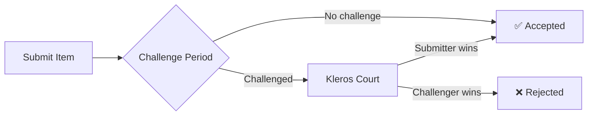

<Frame>
  
</Frame>

# Curate

<Badge>V2</Badge>

**Curate** is a decentralized application for creating and maintaining community-curated registries. Anyone can submit items to a list, and anyone can challenge incorrect or malicious submissions—with disputes resolved by Kleros Court.

Think of it as Wikipedia for structured data, but with economic skin in the game. Submitters stake a deposit that they lose if their submission is successfully challenged. Challengers risk their own deposit if the submission turns out to be valid. This creates a self-sustaining system where participants are economically incentivized to maintain accurate registries.

Curate powers critical infrastructure across Web3: token lists that wallets use to display assets, address tags that block explorers use to label contracts, and security registries that help users avoid scams.

<Note>
  Looking for V1 documentation? See [Curate V1 (Legacy)](/legacy/curate-v1).
</Note>

---

## Key Capabilities

<CardGroup cols={2}>
  <Card title="Permissionless submissions" icon="plus">
    Anyone can add items to a registry by staking a deposit
  </Card>
  <Card title="Community curation" icon="users">
    Anyone can challenge incorrect submissions
  </Card>
  <Card title="Dispute resolution" icon="scale-balanced">
    Contested items are decided by Kleros Court jurors
  </Card>
  <Card title="Flexible schemas" icon="table">
    Create registries for any type of structured data
  </Card>
  <Card title="On-chain data" icon="link">
    Registry data is fully on-chain and queryable
  </Card>
  <Card title="Earn rewards" icon="coins">
    Successful challengers earn the submitter's deposit
  </Card>
</CardGroup>

---

## How It Works

Curate uses a mechanism called a **Token Curated Registry (TCR)**. Here's the flow:

<Steps>
  <Step title="Submission">
    A user submits an item (e.g., a token address with metadata) and stakes a deposit. The submission enters a **pending** state.
  </Step>
  <Step title="Challenge period">
    During the challenge period, anyone can challenge the submission by staking their own deposit. If no one challenges, the item is **accepted** into the registry.
  </Step>
  <Step title="Dispute (if challenged)">
    If challenged, a dispute is created in Kleros Court. Jurors review the evidence and vote on whether the submission meets the registry's acceptance criteria.
  </Step>
  <Step title="Resolution">
    The winning party receives both deposits (minus arbitration fees). The item is either **accepted** or **rejected** based on the ruling.
  </Step>
</Steps>

### The Incentive Structure

The beauty of TCRs is that **you don't need to trust anyone**:

- **Submitters** are incentivized to only submit valid items (or lose their deposit)
- **Challengers** are incentivized to only challenge invalid items (or lose their deposit)
- **Jurors** are incentivized to vote honestly (via Kleros's Schelling point mechanism)

This creates a self-policing system where bad actors are economically punished.

---

## Use Cases

<Tabs>
  <Tab title="Token Lists">
    **Problem:** Wallets and exchanges need to know which tokens are legitimate.
    
    **Solution:** Community-curated token registries where anyone can submit tokens and anyone can challenge scams or duplicates.
    
    **Example:** The Kleros Token Registry is used by wallets to display token information and warn users about unverified assets.
  </Tab>
  
  <Tab title="Address Tags">
    **Problem:** Block explorers show raw addresses with no context about what they are.
    
    **Solution:** Registries that map addresses to human-readable labels (e.g., "Uniswap V3 Router", "Vitalik.eth").
    
    **Example:** Address tag registries power the labels you see on Etherscan and other explorers.
  </Tab>
  
  <Tab title="Contract Security">
    **Problem:** Users can't easily verify if a smart contract is safe to interact with.
    
    **Solution:** Security registries where auditors and community members flag risky or verified contracts.
    
    **Example:** [Kleros Scout](/products/scout) displays security information from Curate registries.
  </Tab>
  
  <Tab title="CDN & Content">
    **Problem:** Decentralized apps need reliable metadata (logos, descriptions, links).
    
    **Solution:** Registries that store and serve verified content metadata.
    
    **Example:** Token logos and project information served to dApps across the ecosystem.
  </Tab>
</Tabs>

### Who Uses Curate?

- **Wallets** query token registries to display asset information
- **Block explorers** use address tags for human-readable labels
- **DeFi protocols** check registries before listing new assets
- **Security tools** aggregate risk information from curated lists
- **DAOs** maintain member or contributor registries

---

## Registry Types

Curate supports two registry architectures:

| Type | Best For | Gas Costs | Flexibility |
|------|----------|-----------|-------------|
| **Curate** (full) | High-value registries with complex schemas | Higher | Maximum |
| **Light Curate** | Simple registries, higher volume | Lower | Standard schemas |

Most new registries use **Light Curate** for cost efficiency. Full Curate is used when you need custom fields or complex acceptance criteria.

---

## What's Next?

<CardGroup cols={3}>

  <Card title="Use Curate" icon="rocket" href="https://help.kleros.io/curate">
    **Step-by-step guides**
    
    Learn how to submit items, challenge submissions, and earn rewards.
    
    → Help Center
  </Card>

  <Card title="Build on Curate" icon="code" href="/developers/products/curate">
    **Integration guide**
    
    Query registry data, build custom UIs, or create your own registry.
    
    → Developer Docs
  </Card>

  <Card title="Understand TCRs" icon="lightbulb" href="/concepts/game-theory">
    **Game theory deep dive**
    
    Learn the economics and incentives behind Token Curated Registries.
    
    → Concepts
  </Card>

</CardGroup>

---

## Quick Links

<CardGroup cols={2}>
  <Card title="Launch Curate" icon="arrow-up-right-from-square" href="https://curate-v2.netlify.app/">
    Open the Curate application
  </Card>
  <Card title="Curate Subgraph" icon="database" href="/reference/api/subgraph">
    Query registry data via GraphQL
  </Card>
  <Card title="Contract Addresses" icon="file-contract" href="/reference/contracts/addresses">
    Curate V2 deployment addresses
  </Card>
  <Card title="Create a Registry" icon="plus" href="https://help.kleros.io/curate/create-registry">
    Guide to deploying your own registry
  </Card>
</CardGroup>