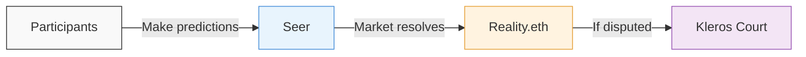

# Foresight

 

<Note>**Experimental** Kleros Foresight is currently running its first public experiments. The platform is under active development and features may change.</Note>

**Kleros Foresight** is a prediction market platform where people stake real value on the outcomes they expect. It helps communities and organizations make better decisions by turning the crowd's collective judgment into reliable estimates. It is built on [Seer](https://seer.pm) for the markets, and uses Kleros Court to resolve outcomes when they are contested.

Foresight applies **futarchy**, an idea proposed by economist Robin Hanson: instead of voting directly on a decision, participants bet on which option will lead to a better result, and the market prices reveal the crowd's best estimate. Foresight brings this on-chain, with Kleros as the backstop for disputed results.

---

## Key Capabilities

<CardGroup cols={3}>
  <Card title="Prediction Markets" icon="chart-line">
    Participants stake real value behind their predictions, creating reliable crowd estimates
  </Card>
  <Card title="Dispute Resolution" icon="gavel">
    When market outcomes are contested, Kleros Court jurors make the final call
  </Card>
  <Card title="Futarchy Sessions" icon="puzzle-piece">
    Orchestrates end-to-end futarchy prediction market sessions for collective decision-making
  </Card>
</CardGroup>

---

## How It Works

Kleros Foresight combines three layers of decentralized infrastructure:

**[Seer](https://seer.pm)** provides the prediction market infrastructure. It uses Gnosis Chain's conditional token framework to create markets where participants buy and sell outcome tokens representing their predictions.

**[Reality.eth](/products/reality)** handles the oracle layer. When a market closes, anyone can submit an answer by posting a bond. Others can challenge by doubling that bond, creating an economic escalation that filters out low-confidence answers.

**[Kleros Court](/court/overview)** is the final arbitration layer. If a Reality.eth answer is disputed beyond the bond escalation threshold, randomly selected Kleros jurors evaluate the evidence and deliver a ruling. Most markets resolve without a dispute, in which case Kleros Court is not involved at all.

<Steps>
  <Step title="Trading Period">
    A session opens with a set of items to predict on (e.g., movies to rate, assets to evaluate). Participants deposit collateral (sDAI or xDAI) and make predictions by moving market estimates toward their beliefs. How long this period lasts is specific to each session.
  </Step>
  <Step title="Selection">
    When the trading period ends, a subset of items is selected for evaluation. Only the selected items are resolved; items that are not selected do not redeem in the parent market. The outcomes are reported through Reality.eth, which anyone can answer and challenge, rather than by a central party.
  </Step>
  <Step title="Evaluation">
    The selected items are evaluated (e.g., a judge watches and rates the movies). The results are submitted to Reality.eth as oracle answers.
  </Step>
  <Step title="Resolution & Redemption">
    If the oracle answers go unchallenged, the markets resolve and participants can redeem their tokens. If answers are disputed, Kleros Court makes the final ruling. Participants who predicted more accurately than the market profit; those who were less accurate take losses.
  </Step>
</Steps>

---

## Token Mechanics at a Glance

When you deposit collateral into a Foresight session, you receive **Item Tokens** for each item in the session. When you make a prediction, your Item Tokens convert into **UP** or **DOWN** tokens depending on whether you predict higher or lower than the current market estimate.

At resolution, UP and DOWN tokens do not redeem directly to a stablecoin. They redeem to the item's token, which in turn redeems in the parent categorical market. The split between UP and DOWN follows Seer's scalar market redemption. See the [Seer documentation](https://seer-3.gitbook.io/seer-documentation) for the exact redemption mechanics.

---

## Current Experiments

### Movie Score Predictions

Kleros Foresight's movie experiments ask participants to predict the percentile score a judge will give to a set of nominated movies after watching them. At the end of the trading period, only a subset of the nominated movies is selected for evaluation: the ones with the highest market estimates, one chosen at random, and one the judge picks. This is a direct implementation of Distilled Human Judgment, where the crowd evaluates every item through market prices, but only a small subset needs actual human assessment.

Round 3 is the current live session. Participants need a Web3 wallet on Gnosis Chain with xDAI or sDAI to take part. Verified humans on [Proof of Humanity](/products/proof-of-humanity) or Seer community members can also use monthly Seer credits to participate.

See [foresight.kleros.io](https://foresight.kleros.io) for the current session and its nominated movies.

---

## Foresight in Kleros Governance

Kleros uses its own futarchy tooling for protocol governance. [**KIP-76**](https://forum.kleros.io/t/kip-76-futarchy-based-governance-rule-for-pnk-minting/1347/1) introduced a rule requiring futarchy evaluation for any proposal that would increase PNK token supply. This means that before PNK can be minted, a prediction market must indicate that the minting would not harm PNK's value. [**KIP-84**](https://forum.kleros.io/c/votes/5) further refined the evaluation parameters.

This makes Kleros one of the first protocols to use prediction markets as a constitutional safeguard in its own governance.

---

## Getting Started

To participate in a Foresight session, you'll need:

- A Web3 wallet (Rabby, MetaMask, or similar) connected to **Gnosis Chain**
- **xDAI** for gas fees (transactions on Gnosis are cheap but not free)
- **sDAI** or **xDAI** as collateral for predictions
- If bridging from Ethereum, use the [Gnosis Bridge](https://bridge.gnosischain.com) to convert DAI to xDAI

<Tip>
Keep a small amount of xDAI reserved specifically for gas. If you convert everything to sDAI, you won't be able to pay for transactions.
</Tip>

---

## Learn More

<CardGroup cols={2}>
  <Card title="Beginner Guide" icon="book-open" href="https://docs.google.com/document/d/1ZuOspW3Yu5dtmWw1tFTJS9cImJfhY2oS1qKdrNNrRbA/edit?tab=t.0">
    Step-by-step walkthrough: connecting your wallet, making predictions, and reading your positions
  </Card>
  <Card title="Advanced Guide" icon="graduation-cap" href="https://docs.google.com/document/d/1S9qU5EgcbNlTM5us39snNasle_sE4Z3n2RLzZPtH7Cc/edit?tab=t.0">
    Token mechanics, trade wallets, fill-to-price-cap, portfolio math, and resolution scenarios
  </Card>
</CardGroup>

---

## What's Next?

<CardGroup cols={3}>
  <Card title="Open Kleros Foresight" icon="arrow-right" href="https://foresight.kleros.io/">
    Start making predictions in the current session
  </Card>
  <Card title="Seer Docs" icon="book" href="https://seer-3.gitbook.io/seer-documentation">
    Learn about the underlying prediction market infrastructure
  </Card>
  <Card title="Reality (Oracle)" icon="database" href="/products/reality">
    Understand the oracle layer that resolves market outcomes
  </Card>
</CardGroup>