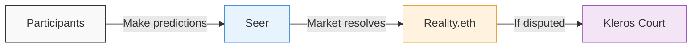

# Futarchy

 

<Note>**Experimental** — Kleros Futarchy is currently running its first public experiments. The platform is under active development and features may change.</Note>

**Kleros Futarchy** is a prediction market platform built on [Seer](https://seer.pm), where Kleros Court handles dispute resolution when market outcomes are contested. It allows communities and organizations to make better decisions by harnessing the collective intelligence of participants who put real stakes behind their predictions.

The concept of futarchy, originally proposed by economist Robin Hanson, uses prediction markets to guide decisions: instead of voting directly on policies, participants bet on which option will lead to better outcomes. The resulting market prices reflect the crowd's best estimate of what's most likely to work. Kleros Futarchy brings this idea on-chain, with Kleros jurors as the final backstop for disputed results.

This approach connects to Vitalik Buterin's concept of **Distilled Human Judgment** — using prediction markets to aggregate crowd wisdom around subjective outcomes, where the full set of questions is too large for any individual to evaluate, but a randomly selected subset can be verified by human judges.

---

## Key Capabilities

<CardGroup cols={3}>
  <Card title="Prediction Markets" icon="chart-line">
    Participants stake real value behind their predictions, creating reliable crowd estimates
  </Card>
  <Card title="Dispute Resolution" icon="gavel">
    When market outcomes are contested, Kleros Court jurors make the final call
  </Card>
  <Card title="Integrable Platform" icon="puzzle-piece">
    Designed for other projects to plug into their own governance and decision-making workflows
  </Card>
</CardGroup>

---

## How It Works

Kleros Futarchy combines three layers of decentralized infrastructure:

**[Seer](https://seer.pm)** provides the prediction market infrastructure. It uses Gnosis Chain's conditional token framework to create markets where participants buy and sell outcome tokens representing their predictions.

**[Reality.eth](/products/reality)** handles the oracle layer. When a market closes, anyone can submit an answer by posting a bond. Others can challenge by doubling that bond, creating an economic escalation that filters out low-confidence answers.

**[Kleros Court](/court/overview)** is the final arbitration layer. If a Reality.eth answer is disputed beyond the bond escalation threshold, randomly selected Kleros jurors evaluate the evidence and deliver a ruling. For most markets that resolve cleanly, this step happens invisibly.

<Steps>
  <Step title="Trading Period">
    A session opens with a set of items to predict on (e.g., movies to rate, assets to evaluate). Participants deposit collateral (sDAI or xDAI) and make predictions by moving market estimates toward their beliefs. This period typically lasts about a month.
  </Step>
  <Step title="Selection">
    When the trading period ends, a subset of items is selected for evaluation. Not every item gets judged — only the selected ones determine profits and losses. Items not selected redeem at neutral value (no profit, no loss).
  </Step>
  <Step title="Evaluation">
    The selected items are evaluated (e.g., a judge watches and rates the movies). The results are submitted to Reality.eth as oracle answers.
  </Step>
  <Step title="Resolution & Redemption">
    If the oracle answers go unchallenged, the markets resolve and participants can redeem their tokens. If answers are disputed, Kleros Court makes the final ruling. Participants who predicted more accurately than the market profit; those who were less accurate take losses.
  </Step>
</Steps>

---

## Token Mechanics at a Glance

When you deposit collateral into a Futarchy session, you receive **Item Tokens** for each item in the session. When you make a prediction, your Item Tokens convert into **UP** or **DOWN** tokens depending on whether you predict higher or lower than the current market estimate.

At resolution, tokens redeem based on the final evaluated score:

| Token | Redemption Formula | Example (Score = 65) |
|-------|-------------------|---------------------|
| UP | Score ÷ Max | 65 ÷ 100 = **$0.65** |
| DOWN | (Max − Score) ÷ Max | (100 − 65) ÷ 100 = **$0.35** |

Your profit or loss depends on the difference between what you paid for your tokens and what they redeem for. UP + DOWN always equals $1.00 at resolution — the market is zero-sum between the two sides.

---

## Current Experiments

### Movie Score Predictions (Session 1)

The first Kleros Futarchy experiment asks participants to predict what percentile score a judge will give to movies after watching them. There are 16 movies in the session, but only 5 are selected for evaluation at the end of the trading period. This is a direct implementation of Distilled Human Judgment: the crowd evaluates every item through market prices, but only a small subset needs actual human assessment.

Participants need a Web3 wallet on Gnosis Chain with xDAI or sDAI to get started. Verified humans on [Proof of Humanity](/products/proof-of-humanity) or Seer community members can also use monthly Seer credits to participate.

### Upcoming: RealT Property Tokens

A follow-up experiment with [RealT](https://realt.co) is in preparation, applying the same futarchy mechanics to real estate asset evaluation.

---

## Futarchy in Kleros Governance

Kleros uses its own futarchy tooling for protocol governance. [**KIP-76**](https://forum.kleros.io/t/kip-76-futarchy-based-governance-rule-for-pnk-minting/1347/1) introduced a rule requiring futarchy evaluation for any proposal that would increase PNK token supply. This means that before PNK can be minted, a prediction market must indicate that the minting would not harm PNK's value. [**KIP-84**](https://forum.kleros.io/c/votes/5) further refined the evaluation parameters.

This makes Kleros one of the first protocols to use prediction markets as a constitutional safeguard in its own governance.

---

## Getting Started

To participate in a Futarchy session, you'll need:

- A Web3 wallet (Rabby, MetaMask, or similar) connected to **Gnosis Chain**
- **xDAI** for gas fees (transactions on Gnosis are cheap but not free)
- **sDAI** or **xDAI** as collateral for predictions
- If bridging from Ethereum, use the [Gnosis Bridge](https://bridge.gnosischain.com) to convert DAI to xDAI

<Tip>
Keep a small amount of xDAI reserved specifically for gas. If you convert everything to sDAI, you won't be able to pay for transactions.
</Tip>

---

## Learn More

<CardGroup cols={2}>
  <Card title="Beginner Guide" icon="book-open" href="https://docs.google.com/document/d/1ZuOspW3Yu5dtmWw1tFTJS9cImJfhY2oS1qKdrNNrRbA/edit?tab=t.0">
    Step-by-step walkthrough: connecting your wallet, making predictions, and reading your positions
  </Card>
  <Card title="Advanced Guide" icon="graduation-cap" href="https://docs.google.com/document/d/1S9qU5EgcbNlTM5us39snNasle_sE4Z3n2RLzZPtH7Cc/edit?tab=t.0">
    Token mechanics, trade wallets, fill-to-price-cap, portfolio math, and resolution scenarios
  </Card>
</CardGroup>

---

## What's Next?

<CardGroup cols={3}>
  <Card title="Open Futarchy" icon="arrow-right" href="https://movies.futarchy.kleros.io/">
    Start making predictions in the current session
  </Card>
  <Card title="Seer Docs" icon="book" href="https://seer-3.gitbook.io/seer-documentation">
    Learn about the underlying prediction market infrastructure
  </Card>
  <Card title="Reality (Oracle)" icon="database" href="/products/reality">
    Understand the oracle layer that resolves market outcomes
  </Card>
</CardGroup>