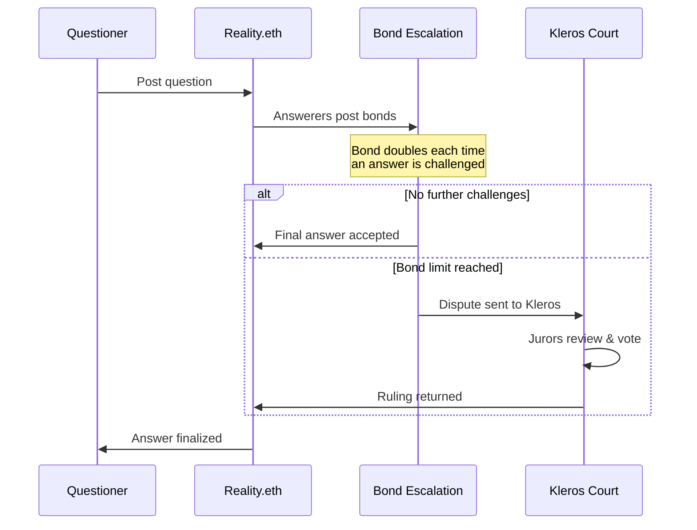

# Reality (Oracle)

<Note>Reality Module currently uses **Kleros V1** for arbitration. V2 integration is planned.</Note>

**Reality.eth** is a crowdsourced oracle system where anyone can post questions and answers with economic bonds. Kleros serves as the **final arbitration layer** — when an answer on Reality.eth is disputed and the bond escalation reaches its limit, the dispute is sent to Kleros Court for resolution.

This combination is widely used in DAO governance through the **Zodiac Reality Module** (formerly SafeSnap), which allows DAOs to execute on-chain transactions based on Snapshot vote outcomes.

---

## How Kleros + Reality.eth Works

<Steps>
  <Step title="Question Posted">
    A question is posted to Reality.eth with a bounty and an arbitrator set to Kleros.
  </Step>
  <Step title="Bond Escalation">
    Answerers post increasingly large bonds to assert their answer. Each challenger must at least double the previous bond. This economic escalation filters out low-confidence answers.
  </Step>
  <Step title="Kleros Arbitration (if needed)">
    If the bond escalation reaches the arbitration threshold, the dispute is sent to Kleros Court. Jurors evaluate the question and provided answers, then vote on the correct outcome.
  </Step>
  <Step title="Answer Finalized">
    The winning answer — whether determined by bond escalation or Kleros ruling — becomes the final oracle output.
  </Step>
</Steps>

---

## Zodiac Reality Module (SafeSnap)

The most prominent integration of Reality.eth + Kleros is the **Zodiac Reality Module**, which enables DAOs using Gnosis Safe to execute on-chain transactions based on Snapshot votes.

**How it works:** After a Snapshot proposal passes, anyone can submit the corresponding transaction to Reality.eth. If no one challenges it within the challenge period, the Safe executes the transaction. If challenged, Kleros resolves the dispute.

This is used by multiple DAOs to bridge off-chain governance (Snapshot votes) to on-chain execution (Gnosis Safe transactions) without relying on a trusted multi-sig.

---

## Use Cases

**DAO Governance Execution** — Execute Snapshot proposal outcomes on-chain with a dispute resolution safety net.

**Prediction Market Resolution** — Settle market outcomes using crowdsourced answers with Kleros as the final backstop.

**Cross-Protocol Oracles** — Provide verified data to smart contracts with economic guarantees and decentralized dispute resolution.

---

## What's Next?

<CardGroup cols={2}>
  <Card title="Reality.eth" icon="globe" href="https://reality.eth.limo">
    Explore the Reality.eth oracle interface
  </Card>
  <Card title="Zodiac Wiki" icon="book" href="https://zodiac.wiki/index.php/Category:Reality_Module">
    Learn about the Reality Module for Gnosis Safe
  </Card>
</CardGroup>