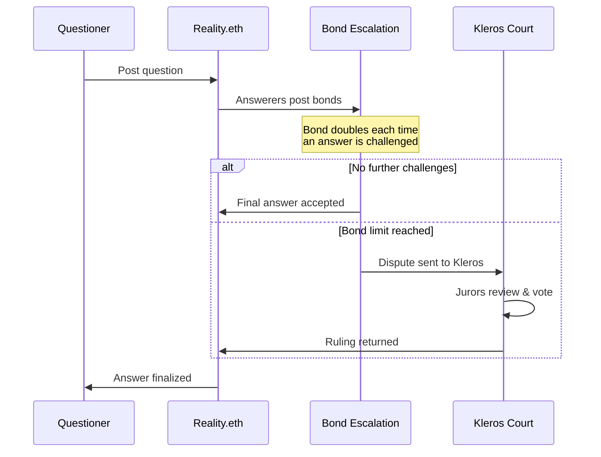

# Reality (Oracle)

<Note>Reality Module currently uses **Kleros V1** for arbitration. V2 integration is planned.</Note>

**Reality.eth** is a crowdsourced oracle system where anyone can post questions and answers with economic bonds. Kleros serves as the **final arbitration layer** when an answer on Reality.eth is disputed and the bond escalation reaches its limit, the dispute is sent to Kleros Court for resolution.

This combination powers **[SafeSnap](/products/safesnap)** — trustless DAO governance where the Zodiac Reality Module executes on-chain transactions based on Snapshot vote outcomes, with Kleros as the final arbitrator.

---

## How Kleros + Reality.eth Works

```mermaid
sequenceDiagram
    participant User as Questioner
    participant RE as Reality.eth
    participant Bonds as Bond Escalation
    participant K as Kleros Court

    User->>RE: Post question
    RE->>Bonds: Answerers post bonds
    Note over Bonds: Bond doubles each time<br/>an answer is challenged
    
    alt No further challenges
        Bonds->>RE: Final answer accepted
    else Bond limit reached
        Bonds->>K: Dispute sent to Kleros
        K->>K: Jurors review & vote
        K->>RE: Ruling returned
    end
    
    RE->>User: Answer finalized
```

<Steps>
  <Step title="Question Posted">
    A question is posted to Reality.eth with a bounty and an arbitrator set to Kleros.
  </Step>
  <Step title="Bond Escalation">
    Answerers post increasingly large bonds to assert their answer. Each challenger must at least double the previous bond. This economic escalation filters out low-confidence answers.
  </Step>
  <Step title="Kleros Arbitration (if needed)">
    If the bond escalation reaches the arbitration threshold, the dispute is sent to Kleros Court. Jurors evaluate the question and provided answers, then vote on the correct outcome.
  </Step>
  <Step title="Answer Finalized">
    The winning answer whether determined by bond escalation or Kleros ruling becomes the final oracle output.
  </Step>
</Steps>

---

## SafeSnap (DAO Governance)

The most prominent use of Reality.eth + Kleros is **SafeSnap**: it lets DAOs execute Snapshot vote outcomes directly against a Gnosis Safe treasury, with Reality.eth verifying the result and Kleros Court as the arbitration backstop — no trusted multisig in the loop.

See the **[SafeSnap product page](/products/safesnap)** for its components, the end-to-end flow, and setup.

---

## Use Cases

**DAO Governance Execution**: Execute Snapshot proposal outcomes on-chain with a dispute resolution safety net.

**Prediction Market Resolution**: Settle market outcomes using crowdsourced answers with Kleros as the final backstop.

**Cross-Protocol Oracles**: Provide verified data to smart contracts with economic guarantees and decentralized dispute resolution.

---

## What's Next?

<CardGroup cols={2}>
  <Card title="SafeSnap" icon="vault" href="/products/safesnap">
    Trustless execution of Snapshot votes against a Safe treasury
  </Card>
  <Card title="Reality.eth" icon="globe" href="https://reality.eth.limo">
    Explore the Reality.eth oracle interface
  </Card>
  <Card title="Zodiac Wiki" icon="book" href="https://zodiac.wiki/index.php/Category:Reality_Module">
    Learn about the Reality Module for Gnosis Safe
  </Card>
</CardGroup>