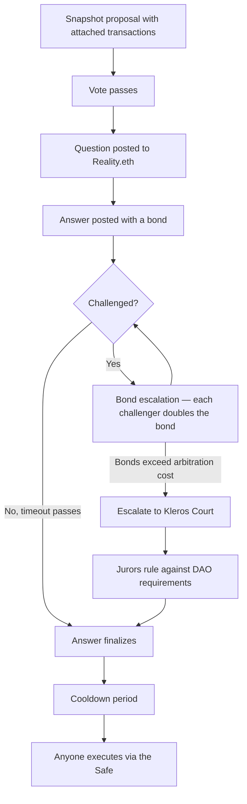

# SafeSnap


<Note>SafeSnap currently uses **Kleros V1** for arbitration. V2 integration is planned.</Note>

**SafeSnap** lets a DAO execute the outcome of an off-chain Snapshot vote directly against its Safe treasury — without trusting a multisig to press the button. Proposals execute optimistically, and any dispute over whether execution matches the vote is settled by Kleros Court.

SafeSnap is actively maintained by Kleros, including the arbitrator proxies that connect it to the Court and the [monitoring tooling](#monitoring-is-not-optional) that keeps it safe to run.

---

## The Problem It Solves

A DAO votes on Snapshot. Snapshot votes are off-chain signed messages — free, gasless, and invisible to the blockchain. The treasury, meanwhile, sits in a Safe that only responds to on-chain transactions.

Something has to bridge the two. Conventionally that is a small set of multisig signers who manually execute what the vote decided. That reintroduces exactly the trust assumption the DAO was trying to remove: the signers can delay, refuse, execute something different, or collude.

SafeSnap replaces those signers with an oracle plus an economic game, backed by a court.

---

## Key Capabilities

<CardGroup cols={3}>
  <Card title="Trustless Execution" icon="key">
    Snapshot vote outcomes execute against the Safe with no multisig signer in the loop
  </Card>
  <Card title="Permissionless Challenge" icon="hand">
    Anyone can dispute an incorrect execution request by posting a bond
  </Card>
  <Card title="Court Backstop" icon="gavel">
    Kleros jurors rule on contested proposals against the DAO's own requirements document
  </Card>
</CardGroup>

---

## Components

| Component | Where it lives | What it does |
| --- | --- | --- |
| **SafeSnap plugin** | Snapshot space | Lets a proposer attach a transaction batch to a proposal |
| **Zodiac Reality Module** | Safe (as a module) | Holds execution rights on the Safe; reads the oracle result |
| **Reality.eth** | On-chain oracle | Answers "did this proposal pass and does this payload match?" |
| **Realitio Arbitration Proxy** | On-chain | Connects Reality.eth to Kleros Court; adds crowdfunded appeals |
| **Kleros Court** | Ethereum (Kleros V1) | Rules on disputed answers |
| **DAO requirements document** | IPFS, via ENS text record | The rulebook jurors judge proposals against |

<Info>
  A Zodiac **module** is a contract granted permission to make a Safe execute transactions. Unlike a signer, a module executes based on code, not a signature.
</Info>

---

## How It Works



<Steps>
  <Step title="Propose with a payload">
    A proposer creates a Snapshot proposal and uses the SafeSnap plugin to attach the exact batch of transactions that should run if it passes.
  </Step>
  <Step title="Vote off-chain">
    Voting happens normally on Snapshot — off-chain and gasless.
  </Step>
  <Step title="Post the question to Reality.eth">
    Once the vote passes, anyone can open a Reality.eth question asking whether the linked proposal passed, whether it contains this exact payload, and whether the payload does what the proposal describes, per the DAO's requirements document.
  </Step>
  <Step title="Bond escalation">
    Someone answers and posts a bond. To contradict an answer, a challenger must post at least double the previous bond. The loser's bond goes to the winner, so asserting a false answer is expensive and challenging a false answer is profitable. Most questions settle here without ever reaching the Court.
  </Step>
  <Step title="Kleros arbitration (only if needed)">
    Once bonds grow large enough that paying arbitration fees is cheaper than doubling again, either side can escalate to Kleros Court. Jurors read the proposal, the payload, and the DAO requirements document, then vote. The ruling is written back to Reality.eth and is binding.
  </Step>
  <Step title="Cooldown">
    After the answer finalizes, a cooldown period must elapse before execution. This is a deliberate safety window during which a clearly invalid outcome can still be reacted to.
  </Step>
  <Step title="Execute">
    Once cooldown ends, anyone can trigger execution from the SafeSnap panel on the Snapshot proposal. The Reality Module instructs the Safe to run the transactions. No signer approval is involved.
  </Step>
</Steps>

---

## The DAO Requirements Document

This is the single most important configuration step, and the most commonly skipped one.

Jurors do not know your DAO's rules. When a proposal is disputed, they need a written standard to judge it against — quorum thresholds, supermajority rules for certain action types, formatting requirements, anything that makes a proposal valid or invalid in your DAO.

That standard is a document uploaded to IPFS and registered as a `daorequirements` text record on your Snapshot space's ENS name:

```
gnosis.eth → daorequirements → /ipfs/QmYourPolicyDoc...
```

<Warning>
  If the `daorequirements` record is not set, jurors have no basis to rule on and disputes may resolve ambiguously. Set this record before activating the module.
</Warning>

---

## Monitoring Is Not Optional

Anyone can post a Reality.eth question and answer it — including for a proposal that never passed. The bond and the Court only protect the treasury **if someone shows up to challenge before the timeout expires**.

That makes monitoring a load-bearing part of the security model, not a nice-to-have.

Kleros maintains [`zodiac-bots`](https://github.com/kleros/zodiac-bots), an open-source service that watches Zodiac Reality modules and pushes alerts to **Slack, Telegram, or email** when proposals and answers appear. It tracks one or more Snapshot spaces, identified by ENS name and a starting block:

```bash
SPACES=kleros.eth:3000000,1inch.eth:6000000
```

Email recipients can be scoped per space, so different DAOs' alerts route to different inboxes.

<Tip>
  If you would rather not self-host, third-party monitoring such as OpenZeppelin Defender can watch the same Reality.eth events.
</Tip>

---

## SafeSnap vs. Kleros Governor

Both execute governance decisions with a Kleros backstop, but they solve different shapes of the problem.

| | SafeSnap | [Governor](/products/governor) |
| --- | --- | --- |
| **Where the vote happens** | Snapshot (off-chain) | Anywhere; Governor only handles execution |
| **What is disputed** | Whether the payload matches the vote | Which of several competing transaction lists is correct |
| **Treasury custody** | Existing Safe | Governor contract |
| **Best for** | DAOs already voting on Snapshot with a Safe treasury | Protocols needing permissionless submission of parameter changes |
| **Protocol version** | Kleros V1 | Kleros V2 |

---

## A Note on Naming

Three names circulate for closely related things:

- **SafeSnap** — Snapshot's name for the plugin. Legacy branding that stuck, and still the term most DAOs recognize.
- **Zodiac Reality Module** — the actual on-chain contract, part of Gnosis's Zodiac standard. The technically correct name.
- **Kleros Reality Module** — a Reality Module configured with a Kleros arbitrator proxy.

This page uses "SafeSnap" for the end-to-end system and "Reality Module" when referring specifically to the contract.

---

## Use Cases

**Treasury management** — Release grants, pay contributors, or rebalance holdings based on Snapshot votes, without a signer bottleneck.

**Progressive decentralization** — A DAO can start with signers in place and remove them later, transferring full control to the module once governance is proven.

**Protocol parameter changes** — Execute upgrades and configuration changes voted on by token holders.

---

## Known Considerations

**Anyone can submit** — Permissionless submission to the Reality Module is a feature, but it means malicious questions can be posted. Monitoring and an active challenger community are what make this safe.

**Bond exhaustion** — A well-funded attacker can force repeated bond escalation rounds. Escalating to Kleros gives a fixed-cost resolution path when bonds become prohibitive.

**Snapshot voting is off-chain** — SafeSnap secures the link between the vote and execution. It does not secure the vote itself; Snapshot's own strategies and quorum rules govern that.

---

## What's Next?

<CardGroup cols={2}>
  <Card title="Set Up SafeSnap" icon="wrench" href="/developers/examples/dao-governance">
    Step-by-step deployment and configuration guide
  </Card>
  <Card title="Reality (Oracle)" icon="database" href="/products/reality">
    How Reality.eth and Kleros arbitration work underneath
  </Card>
  <Card title="Zodiac Documentation" icon="book" href="https://zodiac.wiki/index.php/Category:Reality_Module">
    Official Zodiac Reality Module reference
  </Card>
  <Card title="Snapshot SafeSnap Guide" icon="camera" href="https://docs.snapshot.box/v1-interface/plugins/safesnap-reality">
    Snapshot's plugin documentation
  </Card>
</CardGroup>
