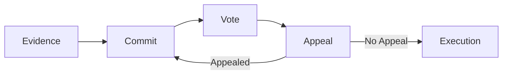

# Arbitrator V2 Specification

Complete specification of the KlerosCore contract, the central arbitrator of Kleros V2.

## Dispute Lifecycle

### Period Transitions

Disputes progress through periods. Each period has a configurable duration set per court:

1. **Evidence** — Parties submit evidence. All jurors must be drawn before advancing.
2. **Commit** — Jurors submit vote commitments (hidden vote courts only).
3. **Vote** — Jurors reveal votes / cast direct votes.
4. **Appeal** — Anyone can fund an appeal. If funded, a new round begins.
5. **Execution** — Ruling is finalized and enforced.

## Appeal Mechanics

- Appeals increase the juror count (typically doubling + 1)
- When juror count exceeds `jurorsForCourtJump`, the dispute moves to the parent court
- If the parent court doesn't support the current dispute kit, it switches to a compatible one
- Appeal funding uses an asymmetric model: losers pay 2× and have half the time

## Reward Distribution

After execution:
- **Coherent jurors** (voted with the final ruling) receive PNK from incoherent jurors and their share of arbitration fees
- **Incoherent jurors** lose a portion of their staked PNK (proportional to `alpha`)
- Distribution is calculated per round

## Emergency Controls

- **Guardian** can pause (blocks staking and rewards)
- **Governor** can unpause and modify parameters
- Core dispute resolution (voting, appeals) continues when paused