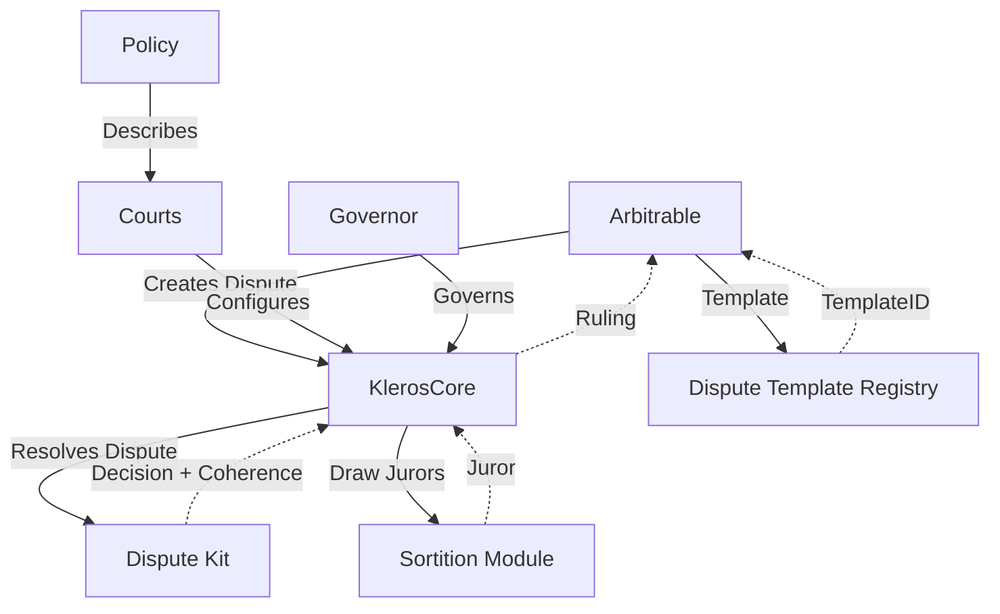

# V2 Architecture

Kleros V2 is a modular dispute resolution protocol deployed on Arbitrum One with cross-chain support.

## Component Interaction

## Core Components

| Component | Role |
|---|---|
| **KlerosCore** | Central arbitrator — dispute lifecycle, appeals, rulings |
| **DisputeKitClassic** | Voting, commit-reveal, appeal funding, incentive distribution |
| **SortitionModule** | Weighted random juror selection from staked PNK |
| **PolicyRegistry** | Court policies stored on IPFS |
| **DisputeTemplateRegistry** | Templates defining what jurors see |
| **Governor** | On-chain governance execution |

## Cross-Chain Architecture

For foreign-chain Arbitrables, the Gateway system abstracts away bridging:

| Component | Chain | Role |
|---|---|---|
| **ForeignGateway** | Foreign chain | Acts as Arbitrator for the Arbitrable |
| **HomeGateway** | Arbitrum | Acts as Arbitrable for KlerosCore |
| **Vea Bridge** | Both | Message transport with optimistic verification |

## Security Model

1. **Cryptoeconomic Security** — Jurors stake PNK as collateral
2. **Random Selection** — Weighted random draws prevent manipulation
3. **Incentive Alignment** — Coherent voters earn, incoherent voters lose stake
4. **Appeal System** — Multiple review rounds with increasing juror counts
5. **Emergency Controls** — Guardian can pause, Governor can unpause