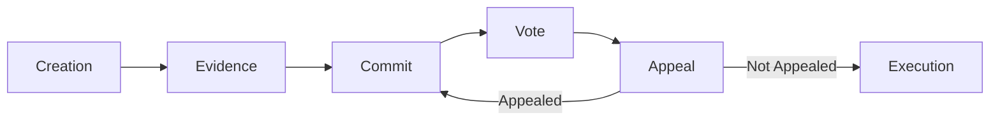

# Dispute Lifecycle

A complete walkthrough of how a dispute progresses through Kleros V2.

## Phases

### 1. Dispute Creation

- Arbitrable contract calls `createDispute()` on KlerosCore with fees
- Dispute template registered (or referenced) defining the question
- Court assigned based on `extraData`
- Initial round created with configured juror count

### 2. Evidence Period

- All parties can submit evidence (on-chain references to IPFS content)
- Jurors are drawn via the Sortition Module
- Period ends when all jurors are drawn AND the evidence time limit expires

### 3. Commit Period (Hidden Vote Courts)

- Jurors submit `keccak256(choice, salt)` commitments
- Commitments cannot be changed once submitted
- Period duration set per court

### 4. Vote Period

- **Hidden vote courts**: Jurors reveal their vote by providing choice + salt matching their commitment
- **Non-hidden courts**: Jurors cast votes directly
- Jurors provide justifications for their votes
- Period duration set per court

### 5. Appeal Period

- Current ruling is computed (plurality of votes)
- Anyone can fund an appeal for any ruling option
- **Winner side**: Pays 1× appeal cost
- **Loser side**: Pays 2× appeal cost, has half the time
- If two sides are fully funded → new round begins with more jurors
- If appeal period expires unfunded → ruling is final

### 6. Execution

- PNK rewards distributed: coherent jurors gain, incoherent lose
- ETH fees distributed to coherent jurors
- `executeRuling()` calls `rule()` on the Arbitrable contract
- Dispute is finalized

## Court Jumps

When the number of jurors in an appeal exceeds `jurorsForCourtJump`, the dispute moves to the parent court. If the parent court doesn't support the current dispute kit, the kit is also changed.

## Key Numbers

| Parameter | Typical Value |
|---|---|
| Evidence period | 3.25 days |
| Vote period | 6.75 days |
| Appeal period | 6.75 days |
| Execution period | 4.5 days |
| Appeal multiplier | 2× jurors + 1 |